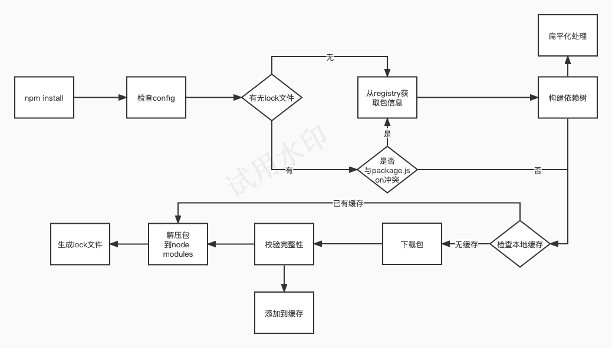

## 1.Node依赖包管理

### 1.1管理器

依赖包通常是项目所依赖的第三方库、工具和框架等资源，它们能够帮助我们减少重复开发、提高效率并且确保项目可以正确的运行。目前比较常见的包管理器有 npm 和 Yarn，npm 是 Node.js 自带的包管理器，它可以安装、共享和分发 node.js 模块。yarn 是FaceBook推出的，主要是针对 npm 早期版本的很多问题。但 npm 也意识到了来自竞争对手的强大压力，因此在 5.x 开始逐个优化看齐。从 5.x 开始就已经和 yarn 不分伯仲了，因此如何选择多数看是否有历史包袱。如果是新项目的话，就看程序员个人的喜好了。

### 1.2`npm`常用命令(v9.6.5)

参考文档：https://docs.npmjs.com/cli/v9/commands

#### 1.2.1升级`npm`到最新版本

```shell
npm install npm@latest -g
```


#### 1.2.2`npm`配置管理

* `set`

  设置`npm`配置项有两种书写方式：

  ```shell
  npm config set key=value [key=value...]
  npm set key=value [key=value...]
  ```

  ```shell
  #设置作者名称
  npm set init-author-name 'Your name'
  #设置作者邮箱
  npm set init-author-email 'Your email'
  #设置作者主页URL
  npm set init-author-url 'http://yourdomain.com'
  #设置license
  npm set init-license 'MIT'
  #设置加入模块时，package.json将记录模块的确切版本，而不是一个可选的兼容版本范围 
  #如：兼容版本号^1.2.3等价于>=1.2.3,<2.0.0
  npm set save-exact true
  ```

* get

  使用`key`查询并显示`npm`配置

  ```shell
  npm config get [key ...]
  npm get [key ...]
  ```

  如果不提供查询的`key`那么就和执行`npm config list`命令一样。

* list

  显示所有`npm`配置。默认显示用户设置的配置，加上`-l`所有的配置。使用`--json`参数以JSON格式显示所有配置。

  ```shell
  npm config list
  npm config list -l
  npm config list --json
  ```

  

* delete

  删除指定的配置。

  ```shell
  npm config delete key [key ...]
  ```

  

* eidit

  编辑配置文件。使用`--global`参数编辑全局配置文件。

  ```shell
  npm config edit
  npm config edit --global
  ```

  

* fix

  修复无效配置项。

  ```shell
  npm config fix
  ```

  

#### 1.2.3初始化命令

使用初始化命令安装声明的模块包并生成或更新现有的`package.json`。

```shell
npm init <package-spec/initializer>
```

初始化命令会转换成对应的`npm exec`操作，例如：

- `npm init foo` -> `npm exec create-foo`
- `npm init @usr/foo` -> `npm exec @usr/create-foo`
- `npm init @usr` -> `npm exec @usr/create`
- `npm init @usr@2.0.0` -> `npm exec @usr/create@2.0.0`
- `npm init @usr/foo@2.0.0` -> `npm exec @usr/create-foo@2.0.0`

如果省略初始化器`npm init`,那么在这个过程中会向用户提问一系列问题，如果你觉得不用修改默认配置，一路回车就可以了。如果使用了`-f`（代表`force`）、`-y`（代表`yes`），则跳过提问阶段，直接生成一个新的`package.json`文件。

```shell
npm init -y
```

使用`-w`参数在当前项目中创建一个工作空间：

```shell
npm init -w workspace/a -y
```


#### 1.2.4安装依赖包

使用`npm install`命令安装依赖包，与此同时会一并安装该包的所有依赖。

```shell
npm install [<package-spec> ...]

#aliases: add, i, in, ins, inst, insta, instal, isnt, isnta, isntal, isntall
```

```shell
##安装工程依赖包到本地node_modules目录
npm install
##使用--production标志或NODE_ENV环境变量为production时只安装package.json的dependencies依赖不会安装devDependencies的依赖
npm install --production
##安装所有package.json里的dependencies和devDependencies中列出来的依赖
npm install --production=false
#将指定的依赖包安装到全局目录中/usr/local/lib/node_modules
npm install -g react

```


#### 1.2.5 预定义命令

```shell
##执行package.json里的预定义命令start，如果没有定义start命令则会默认执行'node server.js'
npm start
```

```shell
{
  "scripts": {
    "start": "node foo.js"
  }
}
```

```shell
npm start

> npm@x.x.x start
> node foo.js

#(foo.js output would be here)
```

```shell
#执行package.json里的预定义命令stop,如果没有定义stop命令则会报错
npm stop
```


### 1.3`npm`加载机制




## 2.package.json

参考1：https://docs.npmjs.com/cli/v9/configuring-npm/package-json

参考2：https://juejin.cn/post/7145759868010364959

### 2.1 描述信息

#### name (required)

项目包名称，字符串。

名称命名规则：

* 长度小于214个字符
* 全部小写不能有大写字母
* 不能和其他模块名称重复
* 不能包含非 URL 安全字符

####  version (required)

版本号。版本号的使用规范如下：

- 版本号的命名遵循语义化版本 2.0.0 规范，格式为：**「主版本号. 次版本号. 修订号」**，通常情况下，修改主版本号是做了大的功能性的改动，修改次版本号是新增了新功能，修改修订号就是修复了一些 bug；
- 如果某个版本的改动较大，并且不稳定，可能如法满足预期的兼容性需求，就需要发布先行版本，先行版本通过会加在版本号的后面，通过 “-” 号连接以点分隔的标识符和版本编译信息：内部版本（alpha）、公测版本（beta）和候选版本（rc，即 release candiate）。

####  description

项目包描述，字符串。帮助其他开发者在搜索时发现你的项目包。

####  keywords

项目包搜索关键字，字符串数组。帮助其他开发者搜索你的项目包。

#### homepage

项目主页地址，字符串。

```json
"homepage": "https://github.com/owner/project#readme"
```


#### bugs

项目bug反馈地址，包括url和邮箱地址。

```json
{
  "url" : "https://github.com/owner/project/issues",
  "email" : "project@hostname.com"
}
```


#### license

项目包的开源许可证。项目的版权拥有人可以使用开源许可证来限制源码的使用、复制、修改和再发布等行为。常见的开源许可证有 BSD、MIT、Apache 等。

```json
{
  "license" : "BSD-3-Clause"
}
```

关于各种许可证的不同之处参考：https://www.ruanyifeng.com/blog/2011/05/how_to_choose_free_software_licenses.html

#### author

项目包作者。有两种写法：

```json
{
  "author": "Barney Rubble <b@rubble.com> (http://barnyrubble.tumblr.com/)"
}
```

```json
{
  "author": {
    "name" : "CUGGZ",
    "email" : "xxxxx@xx.com",
    "url" : "https://juejin.cn/user/3544481220801815"
	}
}
```


#### contributors

项目包的贡献者，和 author 不同的是，该字段是一个数组，包含所有的贡献者，它同样有两种写法：

```json
{
  "contributors": [
    "CUGGZ0 <xxxxx@xx.com> (https://juejin.cn/user/3544481220801815)",
    "CUGGZ1 <xxxxx@xx.com> (https://juejin.cn/user/3544481220801815)"
 	]
}
```

```json
{
  "contributors": [
    {
     "name" : "CUGGZ0",
     "email" : "xxxxx@xx.com",
     "url" : "https://juejin.cn/user/3544481220801815"
    },
    {
     "name" : "CUGGZ1",
     "email" : "xxxxx@xx.com",
     "url" : "https://juejin.cn/user/3544481220801815"
    }
  ]
}
```


#### funding

资助项目包开发的方式。多种配置方式：

```json
{
  "funding": {
    "type" : "individual",
    "url" : "http://example.com/donate"
  },

  "funding": {
    "type" : "patreon",
    "url" : "https://www.patreon.com/my-account"
  },

  "funding": "http://example.com/donate",

  "funding": [
    {
      "type" : "individual",
      "url" : "http://example.com/donate"
    },
    "http://example.com/donateAlso",
    {
      "type" : "patreon",
      "url" : "https://www.patreon.com/my-account"
    }
  ]
}
```


#### repository

代码的存放仓库地址，通常有两种书写形式。

```json
{
  "repository": {
    "type": "git",
    "url": "https://github.com/npm/cli.git"
  }
}
```

```json
"repository": "https://github.com/facebook/react.git"
```

除此之外还可以使用缩写形式：

```json
{
  "repository": "npm/npm",

  "repository": "github:user/repo",

  "repository": "gist:11081aaa281",

  "repository": "bitbucket:user/repo",

  "repository": "gitlab:user/repo"
}
```

如果项目包不是在根目录下而是在工作空间目录下，则需要声明目录：

```json
{
  "repository": {
    "type": "git",
    "url": "https://github.com/facebook/react.git",
    "directory": "packages/react-dom"
  }
}
```


### 2.2 命令脚本

#### bin

配置项目包的可执行文件命令。当项目包被安装到全局库时，可执行文件会被建立链接到全局bins目录，可在命令行直接执行。如果项目包作为另一个项目包的依赖包时，可以通过`npm exec`或`npm run-script`执行。

```json
{
  "bin": {
    "myapp": "./cli.js"
  }
}
```

如果只有一个可执行文件并且命令名称与项目名称相同，则可以直接配置文件路径：

```json
{
  "bin": "./path/to/program"
}
```

#### scripts

项目包生命周期内各时期的命令脚本字典。key是生命周期事件名，值是可执行命令。通常包含项目开发，构建 等 CI 命令，比如：

```json
"scripts": {
  "build": "webpack",
  "prebuild": "xxx", // build 执行之前的钩子
  "postbuild": "xxx" // build 执行之后的钩子
}
```


关于生命周期的各个事件详细参考：https://docs.npmjs.com/cli/v9/using-npm/scripts

#### config

用于设置 scripts 里的脚本在运行时的参数。比如设置 port 为 3001：

```json
"config": {
  "port": "3001"
}
```


### 2.3 工作区

#### workspaces

项目的工作区配置，用于在本地的根目录下管理多个子项目。可以自动地在 npm install 时将 workspaces 下面的包，软链到根目录的 node_modules 中，不用手动执行 `npm link` 操作。在子项目下，它也有自己的 package.json。

通常子项目都会平铺管理在 packages 目录下，所以根目录下 workspaces 通常配置为：

```json
{
  "workspaces": [
    "./packages/*"
  ]
}
```


### 2.4 依赖配置

#### dependencies

运行依赖，也就是项目生产环境下需要用到的依赖。使用 `npm install xxx` 或则 `npm install xxx --save` 时，会被自动插入到该字段中。

```json
"dependencies": {
   "react": "^17.0.2",
   "react-dom": "^17.0.2",
   "react-scripts": "4.0.3",
},
```

这里每一项配置都是一个键值对（key-value）， key 表示模块名称，value 表示模块的版本号。版本号遵循**「主版本号. 次版本号. 修订号」**的格式规定：

- **version** 上面的 react-scripts 的版本 4.0.3 就是固定版本，安装时只安装这个指定的版本；

- **`>version`** 大于特定版本

- **`>=version`** 大于等于特定版本

- **`<version`** 小于特定版本

- **`<=version`** 小于等于特定版本

- **~version** 比如~ 4.0.3，表示安装 4.0.x 的最新版本（不低于 4.0.3），也就是说安装时不会改变主版本号和次版本号；

- **^version:** 比如上面 react 的版本 ^17.0.2，表示安装 17.x.x 的最新版本（不低于 17.0.2），也就是说安装时不会改变主版本号。如果主版本号为 0，那么插入号和波浪号的行为是一致的；

- **latest** 安装最新的版本。

- **http://...**  压缩包下载URL地址

- **\*** 任意版本

- **git...** git仓库地址

  ```html
  <protocol>://[<user>[:<password>]@]<hostname>[:<port>][:][/]<path>[#<commit-ish> | #semver:<semver>]
  ```

  ```json
  git+ssh://git@github.com:npm/cli.git#v1.0.27
  git+ssh://git@github.com:npm/cli#semver:^5.0
  git+https://isaacs@github.com/npm/cli.git
  git://github.com/npm/cli.git#v1.0.27
  ```

  

- **user/repo** Github仓库地址

  ```json
  {
    "name": "foo",
    "version": "0.0.0",
    "dependencies": {
      "express": "expressjs/express",
      "mocha": "mochajs/mocha#4727d357ea",
      "module": "user/repo#feature\/branch"
    }
  }
  ```

  

- **tag** 版本标签

- **path/path/path** 本地项目包

  ```json
  {
    "name": "baz",
    "dependencies": {
      "bar": "file:../foo/bar"
    }
  }
  ```

需要注意，不要把测试或者过渡性的依赖放在 dependencies，避免生产环境出现意外的问题。


#### devDependencies

开发依赖，项目开发环境需要用到而运行时不需要的依赖，用于辅助开发，通常包括项目工程化工具比如 webpack，vite，eslint 等。使用 `npm install xxx -D` 或者 `npm install xxx --save-dev` 时，会被自动插入到该字段中。

```json
"devDependencies": {
  "webpack": "^5.69.0"
}
```


#### peerDependencies

同伴依赖，一种特殊的依赖，不会被自动安装，通常用于表示与另一个包的依赖与兼容性关系来警示使用者。

比如我们安装 A，A 的正常使用依赖 **B@2.x** 版本，那么**B@2.x**就应该被列在 A 的 peerDependencies 下，表示“如果你使用我，那么你也需要安装 B，并且至少是 2.x 版本”。

比如 React 组件库 Ant Design，它的 package.json 里 peerDependencies 为

```json
"peerDependencies": {
  "react": ">=16.9.0",
  "react-dom": ">=16.9.0"
}
```

表示如果你使用 Ant Design，那么你的项目也应该安装 react 和 react-dom，并且版本需要大于等于 16.9.0。


#### peerDependenciesMeta

同伴依赖也可以使用 peerDependenciesMeta 将其指定为可选的。

```json
"peerDependencies": {
  "colors": "^1.4.0"
},
"peerDependenciesMeta": {
  "colors": {
    "optional": true
   }
 }
```


#### bundleDependencies

打包依赖。它的值是一个数组，在发布包时，bundleDependencies 里面的依赖都会被一起打包。

比如指定 react 和 react-dom 为打包依赖：

```json
"bundleDependencies": [
  "react",
  "react-dom"
]
```


#### optionalDependencies

如果需要在找不到包或者安装包失败时，npm 仍然能够继续运行，则可以将该包放在 optionalDependencies 对象中，optionalDependencies 对象中的包会覆盖 dependencies 中同名的包，所以只需在一个地方进行设置即可。

需要注意，由于 optionalDependencies 中的依赖可能并未安装成功，所以一定要做异常处理，否则当获取这个依赖时，如果获取不到就会报错。


#### overrides

overrides 可以重写项目依赖的依赖，及其依赖树下某个依赖的版本号，进行包的替换。

例如， 确保`foo`包永远使用`1.0.0`版本不管依赖中使用的是什么版本：

```json
{
  "overrides": {
    "foo": "1.0.0"
  }
}
```

除此之外，`foo`包下的`bar`包使用`1.0.0`版本：

```json
{
  "overrides": {
    "foo": {
      ".": "1.0.0",
      "bar": "1.0.0"
    }
  }
}
```

当然项目包重写还可以指定在某个特定的版本或特定的版本范围下生效，如：

```json
//当foo做为bar@2.0.0的子包时使用1.0.0版本
{
  "overrides": {
    "bar@2.0.0": {
      "foo": "1.0.0"
    }
  }
}
```

### 2.5 发布配置

#### files

files 配置是一个数组，用来描述当把 npm 包作为依赖包安装时需要说明的文件列表。当 npm 包发布时，files 指定的文件会被推送到 npm 服务器中，如果指定的是文件夹，那么该文件夹下面所有的文件都会被提交。如果缺省则会使用默认值`["*"]`，包含所有文件。

```json
"files": [
  "filename.js",
  "directory/",
  "glob/*.{js,json}"
 ]
```

如果有不想提交的文件，可以在项目根目录中新建一个. npmignore 文件，并在其中说明不需要提交的文件，防止垃圾文件推送到 npm 上。这个文件的形式和. gitignore 类似。在根目录下的`.npmignore`不会重写`files`里的设置，但是在子目录下的`.npmignore`会重写。例如：

```json
node_modules
.vscode
build
.DS_Store
```

默认被自动提交的文件包括:

- `package.json`
- `README`
- `LICENSE` / `LICENCE`
- The file in the "main" field

默认不被提交的文件:

- `.git`
- `CVS`
- `.svn`
- `.hg`
- `.lock-wscript`
- `.wafpickle-N`
- `.*.swp`
- `.DS_Store`
- `._*`
- `npm-debug.log`
- `.npmrc`
- `node_modules`
- `config.gypi`
- `*.orig`
- `package-lock.json` (use [`npm-shrinkwrap.json`](https://docs.npmjs.com/cli/v9/configuring-npm/npm-shrinkwrap-json) if you wish it to be published)

#### main

main 字段用来指定加载的入口文件，在 browser 和 Node 环境中都可以使用。如果我们将项目发布为 npm 包，那么当使用 require 导入 npm 包时，返回的就是 main 字段所列出的文件的 module.exports 属性。如果不指定该字段，默认是项目根目录下的 index.js。如果没找到，就会报错。

```json
"main": "./index.js"
```

#### browser

如果 npm 项目包只在 web 端使用，并且严禁在 server 端使用，使用 browser 来定义入口文件。

```json
"browser": "./browser/index.js"
```

#### private

如果是私有项目，不希望发布到公共 npm 仓库上，可以将 private 设为 true。

```json
{
  "private": true
}
```

#### publishConfig

顾名思义，publishConfig 就是 npm 包发布时使用的配置。

```json
"publishConfig": {
  "registry": "https://registry.npmjs.org/"
}
```

配置项详细参考：https://docs.npmjs.com/cli/v9/using-npm/config

### 2.6 运行系统环境要求

#### engines

一些项目由于兼容性问题会对 node 或者包管理器有特定的版本号要求。

```json
"engines": {
 "node": ">=8.10.3 <12.13.0",
  "npm": ">=6.9.0"
}
```

#### os

在 linux 上能正常运行的项目可能在 windows 上会出现异常，使用 os 字段可以指定项目可运行的操作系统。

```json
{
  "os": [
    "darwin",
    "linux"
  ]
}
```

#### cpu

指定项目只能在特定的 CPU 体系上运行。

```json
{
  "cpu": [
    "x64",
    "ia32"
  ]
}
```

```json
//block architectures
{
  "cpu": [
    "!arm",
    "!mips"
  ]
}
```


