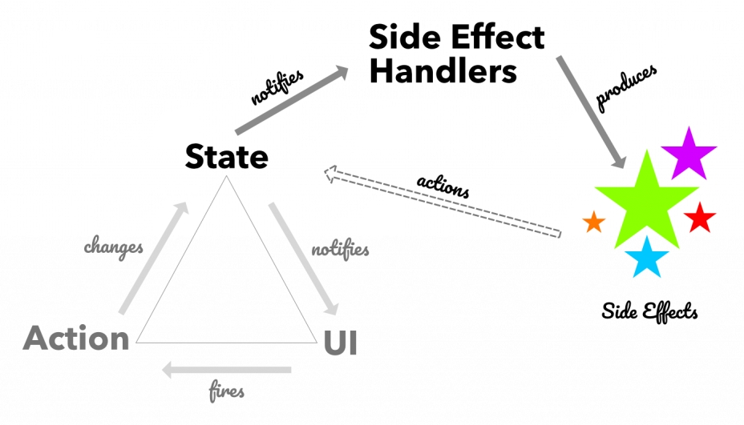

# React笔记


## 一、简介

React 是一个用于构建用户界面的 JAVASCRIPT 库。React 应用程序是由 **组件** 组成的。一个组件是 UI（用户界面）的一部分，它拥有自己的逻辑和外观。组件可以小到一个按钮，也可以大到整个页面。React具有以下特点：

- **声明式设计** −React采用声明范式，可以轻松描述应用。
- **高效** −React通过对DOM的模拟，最大限度地减少与DOM的交互。
- **灵活** −React可以与已知的库或框架很好地配合。
- **JSX** − JSX 是 JavaScript 语法的扩展。React 开发不一定使用 JSX ，但我们建议使用它。
- **组件** − 通过 React 构建组件，使得代码更加容易得到复用，能够很好的应用在大项目的开发中。
- **单向响应的数据流** − React 实现了单向响应的数据流，从而减少了重复代码，这也是它为什么比传统数据绑定更简单。

React 可以改变你对可见设计和应用构建的思考。当你使用 React 构建用户界面时，你首先会把它分解成一个个 **组件**，然后，你需要把这些组件连接在一起，使数据流经它们。


## 二、JSX

React 使用 JSX 来替代常规的 JavaScript。

```jsx
const element = <h1>Hello, world!</h1>;
```

这种看起来可能有些奇怪的标签语法既不是字符串也不是 HTML。

它被称为 JSX， 一种 JavaScript 的语法扩展。 JSX 比 HTML 更加严格。你必须闭合标签，如 `<br />`。你的组件也不能返回多个 JSX 标签。你必须将它们包裹到一个共享的父级中，比如 `<div>...</div>` 或使用空的 `<>...</>` 包裹：

```jsx
function AboutPage() {
  return (
    <>
      <h1>About</h1>
      <p>Hello there.<br />How do you do?</p>
    </>
  );
}
```

如果你有大量的 HTML 需要移植到 JSX 中，你可以使用 [在线转换器](https://transform.tools/html-to-jsx)。


### 1.添加样式

在 React 中，你可以使用 `className` 来指定一个 CSS 的 class。它与 HTML 的 [`class`](https://developer.mozilla.org/en-US/docs/Web/HTML/Global_attributes/class) 属性的工作方式相同：

```jsx

```

当你的样式依赖于 JavaScript 变量时，你可以使用 `style` 属性。

```jsx
const user = {
  name: 'Hedy Lamarr',
  imageUrl: 'https://i.imgur.com/yXOvdOSs.jpg',
  imageSize: 90,
};

export default function Profile() {
  return (
    <>
      <h1>{user.name}</h1>
      
    </>
  );
}
```


### 2.显示数据

JSX中使用大括号`{}`嵌入Javascript代码。

```jsx
return (
  
);
```

### 3.条件渲染

* `if`

  ```jsx
  let content;
  if (isLoggedIn) {
    content = <AdminPanel />;
  } else {
    content = <LoginForm />;
  }
  return (
    <div>
      {content}
    </div>
  );
  ```

  

* &&

  ```jsx
  <div>
    {isLoggedIn && <AdminPanel />}
  </div>
  ```

  

* 三目运算符

  ```jsx
  <div>
    {isLoggedIn ? (
      <AdminPanel />
    ) : (
      <LoginForm />
    )}
  </div>
  ```

  

### 4.渲染列表和`key`

Keys 可以在 DOM 中的某些元素被增加或删除的时候帮助 React 识别哪些元素发生了变化。因此你应当给数组中的每一个元素赋予一个确定的标识。一个元素的 key 最好是这个元素在列表中拥有的一个独一无二的字符串。通常，我们使用来自数据的 id 作为元素的 key。数组元素中使用的 key 在其兄弟之间应该是独一无二的。然而，它们不需要是全局唯一的。当我们生成两个不同的数组时，我们可以使用相同的键。

```jsx
const products = [
  { title: 'Cabbage', isFruit: false, id: 1 },
  { title: 'Garlic', isFruit: false, id: 2 },
  { title: 'Apple', isFruit: true, id: 3 },
];

export default function ShoppingList() {
  const listItems = products.map(product =>
    <li
      key={product.id}
      style={{
        color: product.isFruit ? 'magenta' : 'darkgreen'
      }}
    >
      {product.title}
    </li>
  );

  return (
    <ul>{listItems}</ul>
  );
}
```

### 5.响应事件

通过在组件中声明 **事件处理** 函数来响应事件：

```jsx
function MyButton() {
  function handleClick() {
    alert('You clicked me!');
  }

  return (
    <button onClick={handleClick}>
      Click me
    </button>
  );
}
```


## 三、组件

### 1.定义组件

* 函数式

  ```jsx
  function HelloMessage(props) {
      return <h1>Hello World!</h1>;
  }
  ```

  

* 通过类定义的面向对象方式

  ```tsx
  class Welcome extends React.Component {
    render() {
      return <h1>Hello World!</h1>;
    }
  }
  ```

  

### 2.导出组件

通过`export或export default`(详细用法参考ES6语法)导出组件：

```jsx
function Profile() {
  return (
    
  );
}

export default function Gallery() {
  return (
    <section>
      <h1>了不起的科学家们</h1>
      <Profile />
      <Profile />
      <Profile />
    </section>
  );
}
```


### 3.导入组件

通过`import`(详细用法参考ES6语法)导入组件：

```jsx
import Gallery from './Gallery.js';

export default function App() {
  return (
    <Gallery />
  );
}
```


### 4.props

React 组件使用 *props* 来互相通信。每个父组件都可以提供 props 给它的子组件，从而将一些信息传递给它。`props`是不可变的，当一个组件需要改变它的 props（例如，响应用户交互或新数据）时，它不得不“请求”它的父组件传递 **不同的 props** —— 一个新对象！它的旧 props 将被丢弃，最终 JavaScript 引擎将回收它们占用的内存。一个组件可以有多个`props`属性，这些 props 在 `({` 和 `})` 之间，并由逗号分隔。`props`可以设置默认值，如`function Avatar({person, size = 100})`。

```jsx
import { getImageUrl } from './utils.js';

function Avatar({ person, size = 100 }) {
  return (
    
  );
}

export default function Profile() {
  return (
    <div>
      <Avatar
        size={100}
        person={{ 
          name: 'Katsuko Saruhashi', 
          imageId: 'YfeOqp2'
        }}
      />
      <Avatar
        size={80}
        person={{
          name: 'Aklilu Lemma', 
          imageId: 'OKS67lh'
        }}
      />
      <Avatar
        size={50}
        person={{ 
          name: 'Lin Lanying',
          imageId: '1bX5QH6'
        }}
      />
    </div>
  );
}
```

### 5.ref

React 支持一种非常特殊的属性 **Ref** ，你可以用来绑定到 render() 输出的任何组件上。这个特殊的属性允许你引用 render() 返回的相应的支撑实例（ backing instance ）。这样就可以确保在任何时间总是拿到正确的实例。

```tsx
class MyComponent extends React.Component {
  handleClick() {
    // 使用原生的 DOM API 获取焦点
    this.refs.myInput.focus();
  }
  render() {
    //  当组件插入到 DOM 后，ref 属性添加一个组件的引用于到 this.refs
    return (
      <div>
        <input type="text" ref="myInput" />
        <input
          type="button"
          value="点我输入框获取焦点"
          onClick={this.handleClick.bind(this)}
        />
      </div>
    );
  }
}
 
ReactDOM.render(
  <MyComponent />,
  document.getElementById('example')
);
```


### 6.组件的生命周期

参考：https://zh-hans.legacy.reactjs.org/docs/react-component.html#reference

组件的生命周期可分成三个状态：

- Mounting(挂载)：已插入真实 DOM
- Updating(更新)：正在被重新渲染
- Unmounting(卸载)：已移出真实 DOM

每个组件都包含 “生命周期方法”，你可以重写这些方法，以便于在运行过程中特定的阶段执行这些方法。


#### 挂载 

当组件实例被创建并插入 DOM 中时，其生命周期调用顺序如下：

- [**`constructor()`**](https://zh-hans.legacy.reactjs.org/docs/react-component.html#constructor)
- [`static getDerivedStateFromProps()`](https://zh-hans.legacy.reactjs.org/docs/react-component.html#static-getderivedstatefromprops)
- [**`render()`**](https://zh-hans.legacy.reactjs.org/docs/react-component.html#render)
- [**`componentDidMount()`**](https://zh-hans.legacy.reactjs.org/docs/react-component.html#componentdidmount)

#### 更新 

当组件的 props 或 state 发生变化时会触发更新。组件更新的生命周期调用顺序如下：

- [`static getDerivedStateFromProps()`](https://zh-hans.legacy.reactjs.org/docs/react-component.html#static-getderivedstatefromprops)
- [`shouldComponentUpdate()`](https://zh-hans.legacy.reactjs.org/docs/react-component.html#shouldcomponentupdate)
- [**`render()`**](https://zh-hans.legacy.reactjs.org/docs/react-component.html#render)
- [`getSnapshotBeforeUpdate()`](https://zh-hans.legacy.reactjs.org/docs/react-component.html#getsnapshotbeforeupdate)
- [**`componentDidUpdate()`**](https://zh-hans.legacy.reactjs.org/docs/react-component.html#componentdidupdate)

#### 卸载 

当组件从 DOM 中移除时会调用如下方法：

- [**`componentWillUnmount()`**](https://zh-hans.legacy.reactjs.org/docs/react-component.html#componentwillunmount)

#### 错误处理 

当渲染过程，生命周期，或子组件的构造函数中抛出错误时，会调用如下方法：

- [`static getDerivedStateFromError()`](https://zh-hans.legacy.reactjs.org/docs/react-component.html#static-getderivedstatefromerror)
- [`componentDidCatch()`](https://zh-hans.legacy.reactjs.org/docs/react-component.html#componentdidcatch)

### 

## 四、hooks

参考：https://zh-hans.react.dev/reference/react/

所有的hooks都只能在组件的最上层调用，不能在循环里或有条件的情况下使用。

### 1.state hooks

state可以让组件记录用户输入的数据。例如一个表单组件可以用state来记录用户输入，一个图片选取组件可以使用state来记录用户选择的图片。

给组件添加state有两种方法：

#### useState

`useState`方法声明一个state变量并设置一个初始值，返回一个数组对象。格式为`const [state, setState] = useState(initialState);`,使用`setState`方法可以直接修改变量值。

```jsx
import { useState } from 'react';
function MyComponent(){
  const [index, setIndex] = useState(0);
  //...
}

```


#### useReducer

`useReducer`方法给组件添加一个reducer来管理组件的state变量，返回一个数组对象。用法为`const [state, dispatch] = useReducer(reducer, initialArg, init?)`，通`过dispatch`来更改`state`的值。`useReducer`有三个参数：

* reducer 更新state的reducer函数。有两个参数：`state`（当前state值）和`action`（用户触发的操作类型）。reducer需要返回新state值。
* initialArg 初始state计算的参数，可以是任何类型。如果有`init`初始化函数参数则会作为其参数计算state的初始值，否则直接被用作state的初始值。
* init 这是一个可选参数，state初始化函数。通过调用`init(initialArg)`生成state的初始化值。

```jsx
import { useReducer } from 'react';

function reducer(state, action) {
  if (action.type === 'incremented_age') {
    return {
      age: state.age + 1
    };
  }
  throw Error('Unknown action.');
}

export default function Counter() {
  const [state, dispatch] = useReducer(reducer, { age: 42 });

  return (
    <>
      <button onClick={() => {
        dispatch({ type: 'incremented_age' })
      }}>
        Increment age
      </button>
      <p>Hello! You are {state.age}.</p>
    </>
  );
}

```

`useReducer`返回的`dispatch`函数用来触发state值的变更，有一个参数：

* action 可以是任何类型，代表用户触发的操作类型，会传递给`reducer`函数，作为`reducer`函数的第二个参数。


### 2.context hooks

`context`使得组件可以从多级父组件获得数据而不用通过props传递。例如最顶层组件可以通过`context`往下级组件传递app的UI主题，不管中间相隔多少层级。通过`createContext`方法创建一个context，使用`useContext`方法来读取和订阅组件中的context。

#### createContext

使用`createContext`创建一个context。`createContext`有一个参数，就是context的默认值，默认值是不会被改变的，可以是null。

```jsx
const ThemeContext = createContext('light');
```


#### Provider

若要将 context 传递给下级组件，父组件需要包装到相应的 context provider。

```jsx
function MyPage() {
  return (
    <ThemeContext.Provider value="dark">
      <Form />
    </ThemeContext.Provider>
  );
}

function Form() {
  // ... 在内部渲染 buttons ...
}
```

provider 和 `Button` 之间有多少层组件并不重要。当 `Form` 中的任何位置的 `Button` 调用 `useContext(ThemeContext)` 时，它都将接收 `"dark"` 作为值。

如果你忘记了指定 `value`，它会像这样传值 `value={undefined}`。

```jsx
<ThemeContext.Provider>
   <Button />
</ThemeContext.Provider>
```


通过在 provider 中使用不同的值包装树的某个部分，可以覆盖该部分的 context。可以根据需要多次嵌套和覆盖 provider。

```jsx
<ThemeContext.Provider value="dark">
  ...
  <ThemeContext.Provider value="light">
    <Footer />
  </ThemeContext.Provider>
  ...
</ThemeContext.Provider>
```


#### useContext

调用 `useContext` 来读取和订阅`context`。`useContext` 为调用组件返回 context 的值。它被确定为传递给树中调用组件上方最近的 `SomeContext.Provider` 的 `value`。如果没有这样的 provider，那么返回的将是创建该 context 时传递给 `createContext` 的 `defaultValue`。返回的值始终是最新的。如果 context 发生变化，React 会自动重新渲染读取 context 的组件。`useContext`有一个参数： 

- `SomeContext`：先前用 `createContext`创建的 context。context 本身不包含信息，它只代表你可以提供或从组件中读取的信息类型。

```jsx
import { useContext } from 'react';

function Button() {
  const theme = useContext(ThemeContext);
  // ...
```


#### 应用示例

```jsx
import { createContext, useContext, useState } from 'react';

const ThemeContext = createContext('light');

export default function MyApp() {
  const [theme, setTheme] = useState('light');
  return (
    <>
      <ThemeContext.Provider value={theme}>
        <Form />
      </ThemeContext.Provider>
      <Button onClick={() => {
        setTheme(theme === 'dark' ? 'light' : 'dark');
      }}>
        Toggle theme
      </Button>
    </>
  )
}

function Form({ children }) {
  return (
    <Panel title="Welcome">
      <Button>Sign up</Button>
      <Button>Log in</Button>
    </Panel>
  );
}

function Panel({ title, children }) {
  const theme = useContext(ThemeContext);
  const className = 'panel-' + theme;
  return (
    <section className={className}>
      <h1>{title}</h1>
      {children}
    </section>
  )
}

function Button({ children, onClick }) {
  const theme = useContext(ThemeContext);
  const className = 'button-' + theme;
  return (
    <button className={className} onClick={onClick}>
      {children}
    </button>
  );
}
```


### 3.ref hooks

`Refs`让组件可以持有一些非渲染数据，数据的更新不会触发组件的重新渲染。`Refs`是React系统的逃生仓。通常用来操作DOM节点。

**不要在渲染期间写入 \*或者读取\* `ref.current`。**如果 **不得不** 在渲染期间读取 或者写入，使用 state 代替。

#### useRef

引用一个不需要渲染的值。

参数 ：

- `initialValue`：ref 对象的 `current` 属性的初始值。可以是任意类型的值。这个参数会首次渲染后被忽略。

返回值 ：

`useRef` 返回一个只有一个属性的对象:

- `current`：最初，它被设置为你传递的 `initialValue`。之后你可以把它设置为其他值。如果你把 ref 对象作为一个 JSX 节点的 `ref` 属性传递给 React，React 将为它设置 `current` 属性。

```jsx
import { useState, useRef } from 'react';

export default function Stopwatch() {
  const [startTime, setStartTime] = useState(null);
  const [now, setNow] = useState(null);
  const intervalRef = useRef(null);

  function handleStart() {
    setStartTime(Date.now());
    setNow(Date.now());

    clearInterval(intervalRef.current);
    intervalRef.current = setInterval(() => {
      setNow(Date.now());
    }, 10);
  }

  function handleStop() {
    clearInterval(intervalRef.current);
  }

  let secondsPassed = 0;
  if (startTime != null && now != null) {
    secondsPassed = (now - startTime) / 1000;
  }

  return (
    <>
      <h1>Time passed: {secondsPassed.toFixed(3)}</h1>
      <button onClick={handleStart}>
        Start
      </button>
      <button onClick={handleStop}>
        Stop
      </button>
    </>
  );
}
```

使用 ref 操作DOM是非常常见的。React 内置了对它的支持。

```jsx
//滚动图片到视图
import { useRef } from 'react';

export default function CatFriends() {
  const listRef = useRef(null);

  function scrollToIndex(index) {
    const listNode = listRef.current;
    // This line assumes a particular DOM structure:
    const imgNode = listNode.querySelectorAll('li > img')[index];
    imgNode.scrollIntoView({
      behavior: 'smooth',
      block: 'nearest',
      inline: 'center'
    });
  }

  return (
    <>
      <nav>
        <button onClick={() => scrollToIndex(0)}>
          Tom
        </button>
        <button onClick={() => scrollToIndex(1)}>
          Maru
        </button>
        <button onClick={() => scrollToIndex(2)}>
          Jellylorum
        </button>
      </nav>
      <div>
        <ul ref={listRef}>
          <li>
            
          </li>
          <li>
            
          </li>
          <li>
            
          </li>
        </ul>
      </div>
    </>
  );
}
```

```jsx
//播放和暂停视频
import { useState, useRef } from 'react';

export default function VideoPlayer() {
  const [isPlaying, setIsPlaying] = useState(false);
  const ref = useRef(null);

  function handleClick() {
    const nextIsPlaying = !isPlaying;
    setIsPlaying(nextIsPlaying);

    if (nextIsPlaying) {
      ref.current.play();
    } else {
      ref.current.pause();
    }
  }

  return (
    <>
      <button onClick={handleClick}>
        {isPlaying ? 'Pause' : 'Play'}
      </button>
      <video
        width="250"
        ref={ref}
        onPlay={() => setIsPlaying(true)}
        onPause={() => setIsPlaying(false)}
      >
        <source
          src="https://interactive-examples.mdn.mozilla.net/media/cc0-videos/flower.mp4"
          type="video/mp4"
        />
      </video>
    </>
  );
}
```


#### useImperativeHandle

用来自定义由 ref 暴露出来的句柄。默认情况下，组件不会将它们的 DOM 节点暴露给父组件。使用useImperativeHandle向父组件暴露一个自定义的 ref 句柄或暴露命令式方法。

参数 

- `ref`：该 `ref` 是你从 [`forwardRef` 渲染函数](https://zh-hans.react.dev/reference/react/forwardRef#render-function) 中获得的第二个参数。
- `createHandle`：该函数无需参数，它返回你想要暴露的 ref 的句柄。该句柄可以包含任何类型。通常，你会返回一个包含你想暴露的方法的对象。
- **可选的** `dependencies`：函数 `createHandle` 代码中所用到的所有反应式的值的列表。反应式的值包含 props、状态和其他所有直接在你组件体内声明的变量和函数。倘若你的代码检查器已 [为 React 配置好](https://zh-hans.react.dev/learn/editor-setup#linting)，它会验证每一个反应式的值是否被正确指定为依赖项。该列表的长度必须是一个常数项，并且必须按照 `[dep1, dep2, dep3]` 的形式罗列各依赖项。React 会使用 [`Object.is`](https://developer.mozilla.org/en-US/docs/Web/JavaScript/Reference/Global_Objects/Object/is) 来比较每一个依赖项与其对应的之前值。如果一次重新渲染导致某些依赖项发生了改变，或你没有提供这个参数列表，你的函数 `createHandle` 将会被重新执行，而新生成的句柄则会被分配给 ref。

返回值 

`useImperativeHandle` 返回 `undefined`。

```jsx
//MyInput
import { forwardRef, useRef, useImperativeHandle } from 'react';

const MyInput = forwardRef(function MyInput(props, ref) {
  const inputRef = useRef(null);

  //在这里不直接暴露inputDOM给父节点而是返回一个方法对象
  useImperativeHandle(ref, () => {
    return {
      focus() {
        inputRef.current.focus();
      },
      scrollIntoView() {
        inputRef.current.scrollIntoView();
      },
    };
  }, []);

  return <input {...props} ref={inputRef} />;
});
```


```jsx
import { useRef } from 'react';
import MyInput from './MyInput.js';

export default function Form() {
  const ref = useRef(null);

  function handleClick() {
    ref.current.focus();
    // 下方代码不起作用，因为 DOM 节点并未被暴露出来：
    // ref.current.style.opacity = 0.5;
  }

  return (
    <form>
      <MyInput label="Enter your name:" ref={ref} />
      <button type="button" onClick={handleClick}>
        Edit
      </button>
    </form>
  );
}
```


**不要滥用 ref。** 你应当仅在你没法通过 prop 来表达 *命令式* 行为的时候才使用 ref：例如，滚动到指定节点、聚焦某个节点、触发一次动画，以及选择文本等等。**如果可以通过 prop 实现，那就不应该使用 ref**。


### 4.effect hooks

Effects允许组件连接到外部系统并与之同步。这包括处理网络、浏览器 DOM、动画、使用不同 UI 库编写的小部件以及其他非 React 代码。

#### useEffect

用来与外部系统做同步处理的hook。而且这些效果只会在客户端执行不会在服务器渲染时执行。

参数

* setup 

  效果函数，可以返回一个清理函数。当组件挂载到DOM时react会执行效果函数。当组件依赖值更新的时候会先执行清理函数（如果有的话，此时使用旧的依赖值）然后执行效果函数（此时使用新的依赖值）。当组件被移除时会执行清理函数（如果有的话）。

* dependencies

  可选值。setup函数的依赖值列表（必须是固定长度的，如：`[dep1, dep2, dep3]`），可以是props、state或者组件内声明的其他变量。 如果忽略这个参数的话，每次重新渲染组件时都会执委效果函数。如果依赖列表中包含你在组件内定义的对象或函数，可能会导致效果函数被重复执行，为了解决这个问题请尽量不要使用这些对象或函数做为依赖值。

返回值

* `undefined`

使用示例：

```jsx
//监听浏览器全局事件
export default function App() {
  const [position, setPosition] = useState({ x: 0, y: 0 });

  useEffect(() => {
    function handleMove(e) {
      setPosition({ x: e.clientX, y: e.clientY });
    }
    window.addEventListener('pointermove', handleMove);
    return () => {
      window.removeEventListener('pointermove', handleMove);
    };
  }, []);

  return (
    <div style={{
      position: 'absolute',
      backgroundColor: 'pink',
      borderRadius: '50%',
      opacity: 0.6,
      transform: `translate(${position.x}px, ${position.y}px)`,
      pointerEvents: 'none',
      left: -20,
      top: -20,
      width: 40,
      height: 40,
    }} />
  );
}
```

```jsx
//触发动画效果
import { useState, useEffect, useRef } from 'react';
import { FadeInAnimation } from './animation.js';

function Welcome() {
  const ref = useRef(null);

  useEffect(() => {
    const animation = new FadeInAnimation(ref.current);
    animation.start(1000);
    return () => {
      animation.stop();
    };
  }, []);

  return (
    <h1
      ref={ref}
      style={{
        opacity: 0,
        color: 'white',
        padding: 50,
        textAlign: 'center',
        fontSize: 50,
        backgroundImage: 'radial-gradient(circle, rgba(63,94,251,1) 0%, rgba(252,70,107,1) 100%)'
      }}
    >
      Welcome
    </h1>
  );
}

export default function App() {
  const [show, setShow] = useState(false);
  return (
    <>
      <button onClick={() => setShow(!show)}>
        {show ? 'Remove' : 'Show'}
      </button>
      <hr />
      {show && <Welcome />}
    </>
  );
}


//animation.js
export class FadeInAnimation {
  constructor(node) {
    this.node = node;
  }
  start(duration) {
    this.duration = duration;
    if (this.duration === 0) {
      // Jump to end immediately
      this.onProgress(1);
    } else {
      this.onProgress(0);
      // Start animating
      this.startTime = performance.now();
      this.frameId = requestAnimationFrame(() => this.onFrame());
    }
  }
  onFrame() {
    const timePassed = performance.now() - this.startTime;
    const progress = Math.min(timePassed / this.duration, 1);
    this.onProgress(progress);
    if (progress < 1) {
      // We still have more frames to paint
      this.frameId = requestAnimationFrame(() => this.onFrame());
    }
  }
  onProgress(progress) {
    this.node.style.opacity = progress;
  }
  stop() {
    cancelAnimationFrame(this.frameId);
    this.startTime = null;
    this.frameId = null;
    this.duration = 0;
  }
}


```

```jsx
//控制弹窗
import { useState } from 'react';
import ModalDialog from './ModalDialog.js';

export default function App() {
  const [show, setShow] = useState(false);
  return (
    <>
      <button onClick={() => setShow(true)}>
        Open dialog
      </button>
      <ModalDialog isOpen={show}>
        Hello there!
        <br />
        <button onClick={() => {
          setShow(false);
        }}>Close</button>
      </ModalDialog>
    </>
  );
}

//ModalDialog.js
import { useEffect, useRef } from 'react';

export default function ModalDialog({ isOpen, children }) {
  const ref = useRef();

  useEffect(() => {
    if (!isOpen) {
      return;
    }
    const dialog = ref.current;
    dialog.showModal();
    return () => {
      dialog.close();
    };
  }, [isOpen]);

  return <dialog ref={ref}>{children}</dialog>;
}


```

**使用`useEffect`来控制第三方组件**

有时候项目中会使用到一些非react的第三方组件，为了实现让第三方组件和你写的react组件的`props`或`state`数据可以使用`useEffect`来调用第三组件的数据同步方法。例如：

```jsx
//App.js
import { useState } from 'react';
import Map from './Map.js';

export default function App() {
  const [zoomLevel, setZoomLevel] = useState(0);
  return (
    <>
      Zoom level: {zoomLevel}x
      <button onClick={() => setZoomLevel(zoomLevel + 1)}>+</button>
      <button onClick={() => setZoomLevel(zoomLevel - 1)}>-</button>
      <hr />
      <Map zoomLevel={zoomLevel} />
    </>
  );
}


//Map.js
import { useRef, useEffect } from 'react';
import { MapWidget } from './map-widget.js';

export default function Map({ zoomLevel }) {
  const containerRef = useRef(null);
  const mapRef = useRef(null);

  useEffect(() => {
    if (mapRef.current === null) {
      mapRef.current = new MapWidget(containerRef.current);
    }

    const map = mapRef.current;
    map.setZoom(zoomLevel);
  }, [zoomLevel]);

  return (
    <div
      style={{ width: 200, height: 200 }}
      ref={containerRef}
    />
  );
}

//map-widget.js
import 'leaflet/dist/leaflet.css';
import * as L from 'leaflet';

export class MapWidget {
  constructor(domNode) {
    this.map = L.map(domNode, {
      zoomControl: false,
      doubleClickZoom: false,
      boxZoom: false,
      keyboard: false,
      scrollWheelZoom: false,
      zoomAnimation: false,
      touchZoom: false,
      zoomSnap: 0.1
    });
    L.tileLayer('https://tile.openstreetmap.org/{z}/{x}/{y}.png', {
      maxZoom: 19,
      attribution: '© OpenStreetMap'
    }).addTo(this.map);
    this.map.setView([0, 0], 0);
  }
  setZoom(level) {
    this.map.setZoom(level);
  }
}

```

**实现加载数据效果**

```jsx
import { useState, useEffect } from 'react';
import { fetchBio } from './api.js';

export default function Page() {
  const [person, setPerson] = useState('Alice');
  const [bio, setBio] = useState(null);
  useEffect(() => {
    async function startFetching() {
      setBio(null);
      const result = await fetchBio(person);
      if (!ignore) {
        setBio(result);
      }
    }

    let ignore = false;
    startFetching();
    return () => {
      ignore = true;
    }
  }, [person]);

  return (
    <>
      <select value={person} onChange={e => {
        setPerson(e.target.value);
      }}>
        <option value="Alice">Alice</option>
        <option value="Bob">Bob</option>
        <option value="Taylor">Taylor</option>
      </select>
      <hr />
      <p><i>{bio ?? 'Loading...'}</i></p>
    </>
  );
}


```


#### useLayoutEffect

与useEffect类似，但是useLayoutEffect在浏览器重新绘制屏幕前执行，会消耗性能所以尽可能使用useEffect。

用例：调用 useLayoutEffect 在浏览器重新绘制屏幕之前执行布局测量

```jsx
//App.js
import ButtonWithTooltip from './ButtonWithTooltip.js';

export default function App() {
  return (
    <div>
      <ButtonWithTooltip
        tooltipContent={
          <div>
            This tooltip does not fit above the button.
            <br />
            This is why it's displayed below instead!
          </div>
        }
      >
        Hover over me (tooltip above)
      </ButtonWithTooltip>
      <div style={{ height: 50 }} />
      <ButtonWithTooltip
        tooltipContent={
          <div>This tooltip fits above the button</div>
        }
      >
        Hover over me (tooltip below)
      </ButtonWithTooltip>
      <div style={{ height: 50 }} />
      <ButtonWithTooltip
        tooltipContent={
          <div>This tooltip fits above the button</div>
        }
      >
        Hover over me (tooltip below)
      </ButtonWithTooltip>
    </div>
  );
}

//ButtonWithTooltip.js
import { useState, useRef } from 'react';
import Tooltip from './Tooltip.js';

export default function ButtonWithTooltip({ tooltipContent, ...rest }) {
  const [targetRect, setTargetRect] = useState(null);
  const buttonRef = useRef(null);
  return (
    <>
      <button
        {...rest}
        ref={buttonRef}
        onPointerEnter={() => {
          const rect = buttonRef.current.getBoundingClientRect();
          setTargetRect({
            left: rect.left,
            top: rect.top,
            right: rect.right,
            bottom: rect.bottom,
          });
        }}
        onPointerLeave={() => {
          setTargetRect(null);
        }}
      />
      {targetRect !== null && (
        <Tooltip targetRect={targetRect}>
          {tooltipContent}
        </Tooltip>
      )
    }
    </>
  );
}

//Tooltip.js
import { useRef, useLayoutEffect, useState } from 'react';
import { createPortal } from 'react-dom';
import TooltipContainer from './TooltipContainer.js';

export default function Tooltip({ children, targetRect }) {
  const ref = useRef(null);
  const [tooltipHeight, setTooltipHeight] = useState(0);

  useLayoutEffect(() => {
    const { height } = ref.current.getBoundingClientRect();
    setTooltipHeight(height);
    console.log('Measured tooltip height: ' + height);
  }, []);

  let tooltipX = 0;
  let tooltipY = 0;
  if (targetRect !== null) {
    tooltipX = targetRect.left;
    tooltipY = targetRect.top - tooltipHeight;
    if (tooltipY < 0) {
      // It doesn't fit above, so place below.
      tooltipY = targetRect.bottom;
    }
  }

  return createPortal(
    <TooltipContainer x={tooltipX} y={tooltipY} contentRef={ref}>
      {children}
    </TooltipContainer>,
    document.body
  );
}

//TooltipContainer.js
export default function TooltipContainer({ children, x, y, contentRef }) {
  return (
    <div
      style={{
        position: 'absolute',
        pointerEvents: 'none',
        left: 0,
        top: 0,
        transform: `translate3d(${x}px, ${y}px, 0)`
      }}
    >
      <div ref={contentRef} className="tooltip">
        {children}
      </div>
    </div>
  );
}

```


#### useInsertionEffect

主要用于CSS-in-JS库开发。

```jsx
// Inside your CSS-in-JS library
let isInserted = new Set();
function useCSS(rule) {
  useInsertionEffect(() => {
    // As explained earlier, we don't recommend runtime injection of <style> tags.
    // But if you have to do it, then it's important to do in useInsertionEffect.
    if (!isInserted.has(rule)) {
      isInserted.add(rule);
      document.head.appendChild(getStyleForRule(rule));
    }
  });
  return rule;
}

function Button() {
  const className = useCSS('...');
  return <div className={className} />;
}
```


### 5.performance hooks

优化渲染性能，使用performance hooks来缓存计算结果或跳过不必要的重新渲染达到提升性能。

#### useMemo

用于缓存计算结果。

参数

* calculateValue

  缓存值计算函数。不带参数的纯函数而且返回值可以是任何类型，react会在初始化渲染的时候调用该函数来计算缓存值。当下一次渲染的时候如果dependencies没有改变react将返上次的缓存值，如果dependencies改变则重新计算并更新缓存值。

* dependencies

  缓存值计算函数内参考的值列表。可以包含props、state或其他在组件内定义的变量，但必须是固定长度的，如：`[dep1, dep2, dep3]`。

返回值

* 缓存值 

用例1: 使用useMemo避免重复计算

```jsx
//App.js
import { useState } from 'react';
import { createTodos } from './utils.js';
import TodoList from './TodoList.js';

const todos = createTodos();

export default function App() {
  const [tab, setTab] = useState('all');
  const [isDark, setIsDark] = useState(false);
  return (
    <>
      <button onClick={() => setTab('all')}>
        All
      </button>
      <button onClick={() => setTab('active')}>
        Active
      </button>
      <button onClick={() => setTab('completed')}>
        Completed
      </button>
      <br />
      <label>
        <input
          type="checkbox"
          checked={isDark}
          onChange={e => setIsDark(e.target.checked)}
        />
        Dark mode
      </label>
      <hr />
      <TodoList
        todos={todos}
        tab={tab}
        theme={isDark ? 'dark' : 'light'}
      />
    </>
  );
}


//TodoList.js
import { useMemo } from 'react';
import { filterTodos } from './utils.js'

export default function TodoList({ todos, theme, tab }) {
  const visibleTodos = useMemo(
    () => filterTodos(todos, tab),
    [todos, tab]
  );
  return (
    <div className={theme}>
      <p><b>Note: <code>filterTodos</code> is artificially slowed down!</b></p>
      <ul>
        {visibleTodos.map(todo => (
          <li key={todo.id}>
            {todo.completed ?
              <s>{todo.text}</s> :
              todo.text
            }
          </li>
        ))}
      </ul>
    </div>
  );
}

//utils.js
export function createTodos() {
  const todos = [];
  for (let i = 0; i < 50; i++) {
    todos.push({
      id: i,
      text: "Todo " + (i + 1),
      completed: Math.random() > 0.5
    });
  }
  return todos;
}

export function filterTodos(todos, tab) {
  console.log('[ARTIFICIALLY SLOW] Filtering ' + todos.length + ' todos for "' + tab + '" tab.');
  let startTime = performance.now();
  while (performance.now() - startTime < 500) {
    // Do nothing for 500 ms to emulate extremely slow code
  }

  return todos.filter(todo => {
    if (tab === 'all') {
      return true;
    } else if (tab === 'active') {
      return !todo.completed;
    } else if (tab === 'completed') {
      return todo.completed;
    }
  });
}

```

用例2: 使用useMemo跳过重新渲染

```jsx
//App.js
import { useState } from 'react';
import { createTodos } from './utils.js';
import TodoList from './TodoList.js';

const todos = createTodos();

export default function App() {
  const [tab, setTab] = useState('all');
  const [isDark, setIsDark] = useState(false);
  return (
    <>
      <button onClick={() => setTab('all')}>
        All
      </button>
      <button onClick={() => setTab('active')}>
        Active
      </button>
      <button onClick={() => setTab('completed')}>
        Completed
      </button>
      <br />
      <label>
        <input
          type="checkbox"
          checked={isDark}
          onChange={e => setIsDark(e.target.checked)}
        />
        Dark mode
      </label>
      <hr />
      <TodoList
        todos={todos}
        tab={tab}
        theme={isDark ? 'dark' : 'light'}
      />
    </>
  );
}

//TodoList.js
import { useMemo } from 'react';
import List from './List.js';
import { filterTodos } from './utils.js'

export default function TodoList({ todos, theme, tab }) {
  const visibleTodos = useMemo(
    () => filterTodos(todos, tab),
    [todos, tab]
  );
  return (
    <div className={theme}>
      <p><b>Note: <code>List</code> is artificially slowed down!</b></p>
      <List items={visibleTodos} />
    </div>
  );
}

//List.js
import { memo } from 'react';

const List = memo(function List({ items }) {
  console.log('[ARTIFICIALLY SLOW] Rendering <List /> with ' + items.length + ' items');
  let startTime = performance.now();
  while (performance.now() - startTime < 500) {
    // Do nothing for 500 ms to emulate extremely slow code
  }

  return (
    <ul>
      {items.map(item => (
        <li key={item.id}>
          {item.completed ?
            <s>{item.text}</s> :
            item.text
          }
        </li>
      ))}
    </ul>
  );
});

export default List;

//utils.js
export function createTodos() {
  const todos = [];
  for (let i = 0; i < 50; i++) {
    todos.push({
      id: i,
      text: "Todo " + (i + 1),
      completed: Math.random() > 0.5
    });
  }
  return todos;
}

export function filterTodos(todos, tab) {
  return todos.filter(todo => {
    if (tab === 'all') {
      return true;
    } else if (tab === 'active') {
      return !todo.completed;
    } else if (tab === 'completed') {
      return todo.completed;
    }
  });
}

```


#### useCallback

缓存函数定义。

参数

* fn

  要缓存的函数。缓存函数可以是带任意参数和返回值。在初始化渲染时react会返回该缓存函数，下次渲染时如果dependencies没有改变则返回该缓存函数，如果dependencies改变则重新获取你传入的函数并更新缓存。

* dependencies

  缓存函数内参考的值列表。可以包含props、state或其他在组件内定义的变量，但必须是固定长度的，如：`[dep1, dep2, dep3]`。

用例：

```jsx

//App.js
import { useState } from 'react';
import ProductPage from './ProductPage.js';

export default function App() {
  const [isDark, setIsDark] = useState(false);
  return (
    <>
      <label>
        <input
          type="checkbox"
          checked={isDark}
          onChange={e => setIsDark(e.target.checked)}
        />
        Dark mode
      </label>
      <hr />
      <ProductPage
        referrerId="wizard_of_oz"
        productId={123}
        theme={isDark ? 'dark' : 'light'}
      />
    </>
  );
}

//ProductPage.js
import { useCallback } from 'react';
import ShippingForm from './ShippingForm.js';

export default function ProductPage({ productId, referrer, theme }) {
  const handleSubmit = useCallback((orderDetails) => {
    post('/product/' + productId + '/buy', {
      referrer,
      orderDetails,
    });
  }, [productId, referrer]);

  return (
    <div className={theme}>
      <ShippingForm onSubmit={handleSubmit} />
    </div>
  );
}

function post(url, data) {
  // Imagine this sends a request...
  console.log('POST /' + url);
  console.log(data);
}

//ShippingForm.js
import { memo, useState } from 'react';

const ShippingForm = memo(function ShippingForm({ onSubmit }) {
  const [count, setCount] = useState(1);

  console.log('[ARTIFICIALLY SLOW] Rendering <ShippingForm />');
  let startTime = performance.now();
  while (performance.now() - startTime < 500) {
    // Do nothing for 500 ms to emulate extremely slow code
  }

  function handleSubmit(e) {
    e.preventDefault();
    const formData = new FormData(e.target);
    const orderDetails = {
      ...Object.fromEntries(formData),
      count
    };
    onSubmit(orderDetails);
  }

  return (
    <form onSubmit={handleSubmit}>
      <p><b>Note: <code>ShippingForm</code> is artificially slowed down!</b></p>
      <label>
        Number of items:
        <button type="button" onClick={() => setCount(count - 1)}>–</button>
        {count}
        <button type="button" onClick={() => setCount(count + 1)}>+</button>
      </label>
      <label>
        Street:
        <input name="street" />
      </label>
      <label>
        City:
        <input name="city" />
      </label>
      <label>
        Postal code:
        <input name="zipCode" />
      </label>
      <button type="submit">Submit</button>
    </form>
  );
});

export default ShippingForm;

```


#### useTransition

允许标记一个state更新操作不阻塞UI，允许其他更新打断该state的更新操作。

参数：无

返回值

* `[isPending, startTransition]`

  `isPending`标志告诉你是否有一个在等待解决的transition

  `startTransition`方法用来标记一个state更新操作为transition。`startTransition`方法有一个参数`scope`, `scope`是一个没有参数没有返回值的同步函数，函数内执行的state更新操作被标记为transition操作。 

```jsx
function TabContainer() {
  const [isPending, startTransition] = useTransition();
  const [tab, setTab] = useState('about');

  function selectTab(nextTab) {
    startTransition(() => {
      setTab(nextTab);
    });
  }
  // ...
}
```

```jsx
import { useTransition } from 'react';

export default function TabButton({ children, isActive, onClick }) {
  if (isActive) {
    return <b>{children}</b>
  }
  return (
    <button onClick={() => {
      onClick();
    }}>
      {children}
    </button>
  )
}
```

```jsx
import { useTransition } from 'react';

export default function TabButton({ children, isActive, onClick }) {
  const [isPending, startTransition] = useTransition();
  if (isActive) {
    return <b>{children}</b>
  }
  if (isPending) {
    return <b className="pending">{children}</b>;
  }
  return (
    <button onClick={() => {
      startTransition(() => {
        onClick();
      });
    }}>
      {children}
    </button>
  );
}

```


#### useDeferredValue

后台延迟加载UI，允许其他部分先加载。

参数

* `value` 需要延迟加载的值，可以是任何类型。

返回值： 组件初始化渲染时返回最初的设定的值。更新渲染时会返回旧的值渲染，然后在后台使用新的值来渲染最后再更新UI。

```jsx
import { Suspense, useState, useDeferredValue } from 'react';
import SearchResults from './SearchResults.js';

export default function App() {
  const [query, setQuery] = useState('');
  const deferredQuery = useDeferredValue(query);
  return (
    <>
      <label>
        Search albums:
        <input value={query} onChange={e => setQuery(e.target.value)} />
      </label>
      <Suspense fallback={<h2>Loading...</h2>}>
        <SearchResults query={deferredQuery} />
      </Suspense>
    </>
  );
}

```


### 6.其他hooks

以下这些hooks主要用于库开发，一般应用开发中不使用。

详细参考：https://zh-hans.react.dev/reference/react

#### useDebugValue

#### useId

#### useSyncExternalStore


## 五、react-router

React Router 是一个基于React之上的强大路由库，它可以让你向应用中快速地添加视图和数据流，同时保持页面与 URL 间的同步。

React Router 支持的路由方式：

- `BrowserRouter`: 浏览器路由，用于 Web 应用程序。
- `HashRouter`：在路径前加入`#`成为一个哈希值，Hash 模式的好处是不会因为刷新页面而找不到对应路径；
- `MemoryRouter`：不存储 history，路由过程保存在内存中，适用于 React Native 这种非浏览器环境；
- `NativeRouter`：配合 React Native 使用，多用于移动端；
- `StaticRouter`：主要用于服务端渲染时。

参考：https://reactrouter.com/en/main

### 1.安装

```shell
npm install react-router-dom@6
```

### 2.路由配置

客户端路由配置通过`createBrowserRouter`来创建router：

```jsx
import React from "react";
import { createRoot } from "react-dom/client";
import {
  createBrowserRouter,
  RouterProvider,
  Route,
  Link,
} from "react-router-dom";

const router = createBrowserRouter([
  {
    path: "/",
    element: (
      <div>
        <h1>Hello World</h1>
        <Link to="about">About Us</Link>
      </div>
    ),
  },
  {
    path: "about",
    element: <div>About</div>,
  },
]);

createRoot(document.getElementById("root")).render(
  <RouterProvider router={router} />
);
```

#### 数组式配置

```jsx
// Or use plain objects
createBrowserRouter([
  {
    path: "/",
    element: <Root />,
    children: [
      {
        path: "contact",
        element: <Contact />,
      },
      {
        path: "dashboard",
        element: <Dashboard />,
        loader: ({ request }) =>
          fetch("/api/dashboard.json", {
            signal: request.signal,
          }),
      },
      {
        element: <AuthLayout />,
        children: [
          {
            path: "login",
            element: <Login />,
            loader: redirectIfUser,
          },
          {
            path: "logout",
            action: logoutUser,
          },
        ],
      },
    ],
  },
]);
```


#### JSX标签式配置

```jsx
// Configure nested routes with JSX
createBrowserRouter(
  createRoutesFromElements(
    <Route path="/" element={<Root />}>
      <Route path="contact" element={<Contact />} />
      <Route
        path="dashboard"
        element={<Dashboard />}
        loader={({ request }) =>
          fetch("/api/dashboard.json", {
            signal: request.signal,
          })
        }
      />
      <Route element={<AuthLayout />}>
        <Route
          path="login"
          element={<Login />}
          loader={redirectIfUser}
        />
        <Route path="logout" />
      </Route>
    </Route>
  )
);
```

#### 相对路径链接

假设router结构如下：

```jsx
<Route path="home" element={<Home />}>
  <Route path="project/:projectId" element={<Project />}>
    <Route path=":taskId" element={<Task />} />
  </Route>
</Route>
```

那么在`Project`组件里使用相对路可以实现URL跳转：

| In `<Project>` @ `/home/project/123` | Resolved `<a href>`     |
| ------------------------------------ | ----------------------- |
| `<Link to="abc">`                    | `/home/project/123/abc` |
| `<Link to=".">`                      | `/home/project/123`     |
| `<Link to="..">`                     | `/home`                 |
| `<Link to=".." relative="path">`     | `/home/project`         |


### 3.Route

Route用于绑定URL到UI组件，是创建路由器方法的参数。Route可以是对象也可以通过jsx声明。Route的类型定义如下：

```ts
interface RouteObject {
  path?: string;
  index?: boolean;
  children?: React.ReactNode;
  caseSensitive?: boolean;
  id?: string;
  loader?: LoaderFunction;
  action?: ActionFunction;
  element?: React.ReactNode | null;
  Component?: React.ComponentType | null;
  errorElement?: React.ReactNode | null;
  ErrorBoundary?: React.ComponentType | null;
  handle?: RouteObject["handle"];
  shouldRevalidate?: ShouldRevalidateFunction;
  lazy?: LazyRouteFunction<RouteObject>;
}
```


### 4.组件

#### Await

用于显示异步延迟加载数据并自动处理异常错误的组件。

#### Form

一个HTML表单包装器。

#### Link

URL跳转链接组件。包装`<a>`元素指向某个URL资源。

#### NavLink

这是一个特殊的Link组件，可以知道当前是否处于`active`状态，是否牌`pending`状态。通常用于构建导航菜单。

#### Navigate

一个包装`useNavigate`的组件，渲染时将当前URL指向`to`属性指定的URL。

#### Outlet

用于父route的element组件中，在显示子route组件的同时显示父route的element组件。如导航菜单布局中，左边显示菜单右边显示内容。


#### ScrollRestoration

在数据加载完成后，此组件将在位置更改时模拟浏览器的滚动还原，以确保滚动位置恢复到正确的位置，即使跨域也是如此。

### 5.hooks

`react-router-dom`包提供了很多不同的hooks。以下是一些常用的hooks：

#### useParams

`useParams`返回的是一个键/值对对象，键/值对与URL动态传参的参数一一对应。如：路由配置`<Route path='task/:param1/:param2' element={<Task/>}/>`,对应在`Task`组件里使用`let {param1, param2} = useParams();`就可以获取到URL传入的参数param1和param2。子路由从其父路由继承所有参数。

```jsx
import * as React from 'react';
import { Routes, Route, useParams } from 'react-router-dom';

function ProfilePage() {
  // Get the userId param from the URL.
  let { userId } = useParams();
  // ...
}

function App() {
  return (
    <Routes>
      <Route path="users">
        <Route path=":userId" element={<ProfilePage />} />
        <Route path="me" element={...} />
      </Route>
    </Routes>
  );
}
```


#### useNavigation

`useNavigation`hook可以获取页面所有的navigation信息，可用于构建页面跳转pending指示或乐观UI。

`useNavigation`返回一个对象，对象有5个属性：

```jsx
import { useNavigation } from "react-router-dom";

function SomeComponent() {
  const navigation = useNavigation();
  navigation.state;
  navigation.location;
  navigation.formData;
  navigation.formAction;
  navigation.formMethod;
}
```

**state: 'idle'|'submitting'|'loading'**

页面navigation状态，字符串状态字。

* `idle`

  没有navigation事件处于pending状态

* `submitting`

  表单提交触发路由变更

* `loading`

  下个页面的数据加载器执行中


### 6.实用工具

`react-router-dom`包提供了很多不同的utilities。以下是一些常用的utilities：

#### redirect

在`Route`的`loader`或`action`中返回一个`redirect`重定向到另一个route。

```jsx
import { redirect } from "react-router-dom";

const loader = async () => {
  const user = await getUser();
  if (!user) {
    return redirect("/login");
  }
  return null;
};
```


## 六、Mobx

参考：https://www.mobxjs.com

Mobx是一个身经百战的状态管理库，可以让你的应用状态管理变得轻松和可扩展。




### 1.安装

```shell
npm install --save mobx
```

注意：在使用Typescript和babel并且打算走class编码风格的项目中，需要做以下配置：

* `Typescript`

  在`tsconfig.json`中的`compilerOptions`添加：

  ```json
  "useDefineForClassFields": true
  ```

  

* `Babel`

  添加以下babel插件配置：

  ```json
  {
      // Babel < 7.13.0
      "plugins": [["@babel/plugin-proposal-class-properties", { "loose": false }]],
      
      // Babel >= 7.13.0 (https://babeljs.io/docs/en/assumptions)
      "plugins": [
        [
          "@babel/plugin-proposal-class-properties"
        ],
        [
          "@babel/plugin-proposal-private-methods"
        ],
        [
          "@babel/plugin-proposal-private-property-in-object"
        ],
        [
          "@babel/plugin-proposal-decorators",
          {
            "legacy": true
          }
        ]
      ],
      "assumptions": {
        "setPublicClassFields": false
      }
  }
  ```

* 在代码入口（如：`index.tsx`）添加验证脚本

  ```tsx
  if (!new class { x:any }().hasOwnProperty('x')) throw new Error('Transpiler is not configured correctly');
  ```

  

### 2.mobx装饰器

在版本6之前，Mobx鼓励使用ES.next中的decorators,将某个对象标记为`observable`, `computed` 和 `action`。我们在MobX 6中放弃了它们，并建议使用`makeObservable` / `makeAutoObservable`代替。鉴于目前仍有很多代码库，在线文档和教程在使用decorator，我们的规则是，任何可以使用`observable`, `action` 和 `computed`等注解的地方，你也可以使用decorator。

* `@observable`

* `@action`

* `@computed`

* `@observer`

版本6之前的Mobx,不需要在构造函数中调用`makeObservable(this)`。在版本6中，为了让装饰器的实现更简单以及保证装饰器的兼容性，必须在构造函数中调用`makeObservable(this)`。Mobx可以根据 `makeObservable`第二个参数提供的装饰器信息，将实例设置为observable。

```tsx
import { makeObservable, observable, computed, action } from "mobx"

class Todo {
    id = Math.random()
    @observable title = ""
    @observable finished = false

    constructor() {
        makeObservable(this)
    }

    @action
    toggle() {
        this.finished = !this.finished
    }
}

class TodoList {
    @observable todos = []

    @computed
    get unfinishedTodoCount() {
        return this.todos.filter(todo => !todo.finished).length
    }

    constructor() {
        makeObservable(this)
    }
}
```

`mobx-react`中的`observer`除了可以作为函数来使用，也可以作为装饰器，用来修饰类组件:

```tsx
@observer
class Timer extends React.Component {
    /* ... */
}
```


## 七、编码风格


https://cn.mobx.js.org