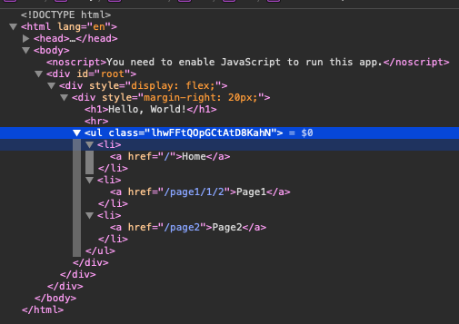

# Sass笔记

Sass 是一款强化 CSS 的辅助工具，它在 CSS 语法的基础上增加了变量 (variables)、嵌套 (nested rules)、混合 (mixins)、导入 (inline imports) 等高级功能，这些拓展令 CSS 更加强大与优雅。使用 Sass 以及 Sass 的样式库（如 [Compass](http://compass-style.org/)）有助于更好地组织管理样式文件，以及更高效地开发项目。

- 完全兼容 CSS3
- 在 CSS 基础上增加变量、嵌套 (nesting)、混合 (mixins) 等功能
- 通过[函数](http://sass-lang.com/docs/yardoc/Sass/Script/Functions.html)进行颜色值与属性值的运算
- 提供控制指令 (control directives)等高级功能
- 自定义输出格式

官方文档：https://sass-lang.com/documentation/

中文文档：https://www.sass.hk/docs/

## 一、格式

* `.sass`

  Sass 语法格式，被称为缩进格式 (Indented Sass) 通常简称 "Sass"，是一种简化格式。它使用 “缩进” 代替 “花括号” 表示属性属于某个选择器，用 “换行” 代替 “分号” 分隔属性，很多人认为这样做比 SCSS 更容易阅读，书写也更快速。这种格式以 `.sass` 作为拓展名。

* `.scss`

  这种格式仅在 CSS3 语法的基础上进行拓展，所有 CSS3 语法在 SCSS 中都是通用的，同时加入 Sass 的特色功能。此外，SCSS 也支持大多数 CSS hacks 写法以及浏览器前缀写法 (vendor-specific syntax)，以及早期的 IE 滤镜写法。这种格式以 `.scss` 作为拓展名。

文件编码格式：

Sass 首先检查 Unicode byte order mark，然后是 `@charset` 声明，最后是 Ruby string encoding，假如都没有检测到，默认使用 UTF-8 编码。与 CSS 相同，使用 `@charset` 可以声明特定的编码格式。在样式文件的起始位置（前面没有任何空白与注释）插入 `@charset "encoding-name"`， Sass 将会按照给出的编码格式编译文件。注意所使用的编码格式必须可转换为 Unicode 字符集。


## 二、CSS功能拓展


### 1.嵌套

Sass 允许将一套 CSS 样式嵌套进另一套样式中，内层的样式将它外层的选择器作为父选择器。

```scss
#main p {
  color: #00ff00;
  width: 97%;

  .redbox {
    background-color: #ff0000;
    color: #000000;
  }
}
```

编译为

```css
#main p {
  color: #00ff00;
  width: 97%; 
}
#main p .redbox {
  background-color: #ff0000;
  color: #000000; 
}
```


### 2.父选择器 `&`

在嵌套 CSS 规则时，有时也需要直接使用嵌套外层的父选择器，可以用 `&` 代表嵌套规则外层的父选择器。

```scss
a {
  font-weight: bold;
  text-decoration: none;
  &:hover { 
    text-decoration: underline; 
  }
  body.firefox & { 
    font-weight: normal; 
  }
}
```

编译为

```css
a {
  font-weight: bold;
  text-decoration: none; 
}
a:hover {
  text-decoration: underline; 
}
body.firefox a {
  font-weight: normal; 
}
```


### 3.属性嵌套

有些 CSS 属性遵循相同的命名空间 (namespace)，比如 `font-family, font-size, font-weight` 都以 `font` 作为属性的命名空间。为了便于管理这样的属性，同时也为了避免了重复输入，Sass 允许将属性嵌套在命名空间中，例如：

```scss
.funky {
  font: {
    family: fantasy;
    size: 30em;
    weight: bold;
  }
}
```

编译为

```css
.funky {
  font-family: fantasy;
  font-size: 30em;
  font-weight: bold; 
}
```


### 4.占位符选择器 `%`

Sass 额外提供了一种特殊类型的选择器：占位符选择器 (placeholder selector)。与常用的 id 与 class 选择器写法相似，只是 `#` 或 `.` 替换成了 `%`。必须通过`@extend`指令调用。


## 三、注释

Sass 支持标准的 CSS 多行注释 `/* */`，以及单行注释 `//`，前者会 被完整输出到编译后的 CSS 文件中，而后者则不会，例如：

```scss
/* This comment is
 * several lines long.
 * since it uses the CSS comment syntax,
 * it will appear in the CSS output. */
body { color: black; }

// These comments are only one line long each.
// They won't appear in the CSS output,
// since they use the single-line comment syntax.
a { color: green; }
```

编译为

```css
/* This comment is
 * several lines long.
 * since it uses the CSS comment syntax,
 * it will appear in the CSS output. */
body {
  color: black; }

a {
  color: green; }
```

将 `!` 作为多行注释的第一个字符表示在压缩输出模式下保留这条注释并输出到 CSS 文件中，通常用于添加版权信息。

## 四、SassScript

### 1.变量

SassScript 最普遍的用法就是变量，变量以美元符号开头，赋值方法与 CSS 属性的写法一样：

```scss
$width: 5em;
```

直接使用即调用变量：

```css
#main {
  width: $width;
}
```

变量支持块级作用域，嵌套规则内定义的变量只能在嵌套规则内使用（局部变量），不在嵌套规则内定义的变量则可在任何地方使用（全局变量）。将局部变量转换为全局变量可以添加 `!global` 声明：

```scss
#main {
  $width: 5em !global;
  width: $width;
}

#sidebar {
  width: $width;
}
```

编译为

```css
#main {
  width: 5em;
}

#sidebar {
  width: 5em;
}
```

可以在变量的结尾添加 `!default` 给一个未通过 `!default` 声明赋值的变量赋值，如果变量已经被赋值，不会再被重新赋值。变量是 null 空值时将视为未被 `!default` 赋值。

```scss
$content: "First content";
$content: "Second content?" !default;
$new_content: "First time reference" !default;

#main {
  content: $content;
  new-content: $new_content;
}
```

编译为

```css
#main {
  content: "First content";
  new-content: "First time reference"; 
}
```

### 2.数据类型

SassScript 支持 6 种主要的数据类型：

- 数字，`1, 2, 13, 10px`

- 字符串，有引号字符串与无引号字符串，`"foo", 'bar', baz`

  SassScript 支持 CSS 的两种字符串类型：有引号字符串 (quoted strings)，如 `"Lucida Grande"` `'http://sass-lang.com'`；与无引号字符串 (unquoted strings)，如 `sans-serif` `bold`，在编译 CSS 文件时不会改变其类型。只有一种情况例外，使用 `#{}` (interpolation) 时，有引号字符串将被编译为无引号字符串，这样便于在 mixin 中引用选择器名：

  ```scss
  //使用mixin 自定义代码段
  @mixin firefox-message($selector) {
    body.firefox #{$selector}:before {
      content: "Hi, Firefox users!";
    }
  }
  //使用@include来引用mixin代码段
  @include firefox-message(".header");
  ```

  编译为

  ```css
  body.firefox .header:before {
    content: "Hi, Firefox users!"; 
  }
  ```

- 颜色，`blue, #04a3f9, rgba(255,0,0,0.5)`

- 布尔型，`true, false`

- 空值，`null`

- 数组 (list)

  用空格或逗号作分隔符，`1.5em 1em 0 2em, Helvetica, Arial, sans-serif`。

  sass list函数赋予了数组更多新功能：`nth` 函数可以直接访问数组中的某一项；`join` 函数可以将多个数组连接在一起；`append` 函数可以在数组中添加新值；而 `@each` 指令能够遍历数组中的每一项。

  用 `()` 表示不包含任何值的空数组（在 Sass 3.3 版之后也视为空的 map）。

- maps

  相当于 JavaScript 的 object，`(key1: value1, key2: value2)`

SassScript 也支持其他 CSS 属性值，比如 Unicode 字符集，或 `!important` 声明。然而Sass 不会特殊对待这些属性值，一律视为无引号字符串。


### 3.运算

* 数字运算

  SassScript 支持数字的加减乘除、取整等运算 (`+, -, *, /, %`)，如果必要会在不同单位间转换值。

  ```scss
  p {
    width: 1in + 8pt;
  }
  ```

  编译为

  ```css
  p {
    width: 1.111in; 
  }
  ```

* 颜色运算

  颜色值的运算是分段计算进行的，也就是分别计算红色，绿色，以及蓝色的值：

  ```scss
  p {
    color: #010203 + #040506;
  }
  ```

  计算 `01 + 04 = 05` `02 + 05 = 07` `03 + 06 = 09`，然后编译为

  ```css
  p {
    color: #050709; 
  }
  ```

* 字符串运算

  `+` 可用于连接字符串。

  注意，如果有引号字符串（位于 `+` 左侧）连接无引号字符串，运算结果是有引号的，相反，无引号字符串（位于 `+` 左侧）连接有引号字符串，运算结果则没有引号。

  ```scss
  p:before {
    content: "Foo " + Bar;
    font-family: sans- + "serif";
  }
  ```

  编译为

  ```css
  p:before {
    content: "Foo Bar";
    font-family: sans-serif; 
  }
  ```

* 布尔运算

  SassScript 支持布尔型的 `and` `or` 以及 `not` 运算。

* 圆括号`()`

  圆括号可以用来影响运算的顺序：

  ```scss
  p {
    width: 1em + (2em * 3);
  }
  ```

  编译为

  ```css
  p {
    width: 7em; 
  }
  ```


### 4.函数

SassScript 定义了多种函数，有些甚至可以通过普通的 CSS 语句调用。

查看完整的 Sass 函数列表：https://sass-lang.com/documentation/modules


### 5.插值语句`#{}`

通过 `#{}` 插值语句可以在选择器或属性名中使用变量：

```scss
$name: foo;
$attr: border;
p.#{$name} {
  #{$attr}-color: blue;
}
```

编译为

```css
p.foo {
  border-color: blue; 
}
```


### 6.@-Rules指令扩展

#### `@import`

Sass 拓展了 `@import` 的功能，允许其导入 SCSS 或 Sass 文件。被导入的文件将合并编译到同一个 CSS 文件中，另外，被导入的文件中所包含的变量或者混合指令 (mixin) 都可以在导入的文件中使用。

通常，`@import` 寻找 Sass 文件并将其导入，但在以下情况下，`@import` 仅作为普通的 CSS 语句，不会导入任何 Sass 文件。

- 文件拓展名是 `.css`；
- 文件名以 `http://` 开头；
- 文件名是 `url()`；
- `@import` 包含 media queries。

没有指定拓展名，Sass 将会试着寻找文件名相同，拓展名为 `.scss` 或 `.sass` 的文件并将其导入。

```scss
@import "foo.scss";
```

等于

```scss
@import "foo";
```

```scss
//导入多个文件
@import "rounded-corners", "text-shadow";
```

导入文件也可以使用 `#{ }` 插值语句，但不是通过变量动态导入 Sass 文件，只能作用于 CSS 的 `url()` 导入方式：

```scss
$family: unquote("Droid+Sans");
@import url("http://fonts.googleapis.com/css?family=\#{$family}");
```

编译为

```css
@import url("http://fonts.googleapis.com/css?family=Droid+Sans");
```


#### `@media`

Sass 中 `@media` 指令与 CSS 中用法一样，只是增加了一点额外的功能：允许其在 CSS 规则中嵌套。如果 `@media` 嵌套在 CSS 规则内，编译时，`@media` 将被编译到文件的最外层，包含嵌套的父选择器。这个功能让 `@media` 用起来更方便，不需要重复使用选择器，也不会打乱 CSS 的书写流程。

```scss
.sidebar {
  width: 300px;
  @media screen and (orientation: landscape) {
    width: 500px;
  }
}
```

编译为

```scss
.sidebar {
  width: 300px; 
}
@media screen and (orientation: landscape) {
    .sidebar {
      width: 500px; 
    } 
}
```

@media` 的 queries 允许互相嵌套使用，编译时，Sass 自动添加 `and

```scss
@media screen {
  .sidebar {
    @media (orientation: landscape) {
      width: 500px;
    }
  }
}
```

编译为

```scss
@media screen and (orientation: landscape) {
  .sidebar {
    width: 500px; 
  } 
}
```

#### `@extend`

使用 `@extend` 告诉 Sass 将一个选择器下的所有样式继承给另一个选择器。

```scss
.error {
  border: 1px #f00;
  background-color: #fdd;
}
.seriousError {
  @extend .error;
  border-width: 3px;
}
```

Class 选择器并不是唯一可以被延伸 (extend) 的，Sass 允许延伸任何定义给单个元素的选择器，比如 `.special.cool`，`a:hover` 或者 `a.user[href^="http://"]` 等，例如：

```scss
.hoverlink {
  @extend a:hover;
}
```

Sass 引入了“占位符选择器” (placeholder selectors)，看起来很像普通的 `id` 或 `class` 选择器，只是 `#` 或 `.` 被替换成了 `%`。可以像 class 或者 id 选择器那样使用，当它们单独使用时，不会被编译到 CSS 文件中。占位符选择器需要通过延伸指令使用，用法与 class 或者 id 选择器一样，被延伸后，占位符选择器本身不会被编译。

```scss
// This ruleset won't be rendered on its own.
#context a%extreme {
  color: blue;
  font-weight: bold;
  font-size: 2em;
}
.notice {
  @extend %extreme;
}
```

编译为

```css
#context a.notice {
  color: blue;
  font-weight: bold;
  font-size: 2em; }
```

在指令中使用 `@extend` 时（比如在 `@media` 中）有一些限制：Sass 不可以将 `@media` 层外的 CSS 规则延伸给指令层内的 CSS，这样会生成大量的无用代码。也就是说，如果在 `@media` （或者其他 CSS 指令）中使用 `@extend`，必须延伸给相同指令层中的选择器。

```scss
@media print {
  .error {
    border: 1px #f00;
    background-color: #fdd;
  }
  .seriousError {
    @extend .error;
    border-width: 3px;
  }
}
```


#### `@at-root`

该指令将一个或多个选择器样式提升到最顶层而不再是嵌套在父选择器里。

```scss
.parent {
  ...
  @at-root .child { ... }
}
```

编译为:

```css
.parent { ... }
.child { ... }
```

多选择器提升:

```scss
.parent {
  ...
  @at-root {
    .child1 { ... }
    .child2 { ... }
  }
  .step-child { ... }
}
```

编译为:

```css
.parent { ... }
.child1 { ... }
.child2 { ... }
.parent .step-child { ... }
```


#### `@debug`

输出调试信息：

```scss
@debug 10em + 12em;
```

编译为 

```
Line 1 DEBUG: 22em
```


#### `@warn`

输出警告信息：

```scss
@mixin adjust-location($x, $y) {
  @if unitless($x) {
    @warn "Assuming #{$x} to be in pixels";
    $x: 1px * $x;
  }
  @if unitless($y) {
    @warn "Assuming #{$y} to be in pixels";
    $y: 1px * $y;
  }
  position: relative; left: $x; top: $y;
}
```

#### `@error`

输出错误信息：

```scss
@mixin adjust-location($x, $y) {
  @if unitless($x) {
    @error "$x may not be unitless, was #{$x}.";
  }
  @if unitless($y) {
    @error "$y may not be unitless, was #{$y}.";
  }
  position: relative; left: $x; top: $y;
}
```


### 7.控制指令

#### `@if`

当 `@if` 的表达式返回值不是 `false` 或者 `null` 时，条件成立，输出 `{}` 内的代码：

```scss
p {
  @if 1 + 1 == 2 { border: 1px solid; }
  @if 5 < 3 { border: 2px dotted; }
  @if null  { border: 3px double; }
}
```

编译为

```css
p {
  border: 1px solid; }
```

`@if` 声明后面可以跟多个 `@else if` 声明，或者一个 `@else` 声明。如果 `@if` 声明失败，Sass 将逐条执行 `@else if` 声明，如果全部失败，最后执行 `@else` 声明，例如：

```scss
$type: monster;
p {
  @if $type == ocean {
    color: blue;
  } @else if $type == matador {
    color: red;
  } @else if $type == monster {
    color: green;
  } @else {
    color: black;
  }
}
```

编译为

```css
p {
  color: green; }
```

#### `@for`

`@for` 指令可以在限制的范围内重复输出格式，每次按要求（变量的值）对输出结果做出变动。这个指令包含两种格式：`@for $var from <start> through <end>`，或者 `@for $var from <start> to <end>`，区别在于 `through` 与 `to` 的含义：*当使用 `through` 时，条件范围包含 `<start>` 与 `<end>` 的值，而使用 `to` 时条件范围只包含 `<start>` 的值不包含 `<end>` 的值*。另外，`$var` 可以是任何变量，比如 `$i`；`<start>` 和 `<end>` 必须是整数值。

```scss
@for $i from 1 through 3 {
  .item-#{$i} { width: 2em * $i; }
}
```

编译为

```css
.item-1 {
  width: 2em; }
.item-2 {
  width: 4em; }
.item-3 {
  width: 6em; }
```


#### `@each`

`@each` 指令的格式是 `$var in <list>`, `$var` 可以是任何变量名，比如 `$length` 或者 `$name`，而 `<list>` 是一连串的值，也就是值列表。

`@each` 将变量 `$var` 作用于值列表中的每一个项目，然后输出结果，例如：

```scss
@each $animal in puma, sea-slug, egret, salamander {
  .#{$animal}-icon {
    background-image: url('/images/#{$animal}.png');
  }
}
```

编译为

```css
.puma-icon {
  background-image: url('/images/puma.png'); }
.sea-slug-icon {
  background-image: url('/images/sea-slug.png'); }
.egret-icon {
  background-image: url('/images/egret.png'); }
.salamander-icon {
  background-image: url('/images/salamander.png'); }
```


#### `@while`

`@while` 指令重复输出格式直到表达式返回结果为 `false`。这样可以实现比 `@for` 更复杂的循环，只是很少会用到。例如：

```scss
$i: 6;
@while $i > 0 {
  .item-#{$i} { width: 2em * $i; }
  $i: $i - 2;
}
```

编译为：

```scss
.item-6 {
  width: 12em; 
}

.item-4 {
  width: 8em; 
}

.item-2 {
  width: 4em; 
}
```


### 8.混合指令mixin

混合指令（Mixin）用于定义可重复使用的样式，避免了使用无语意的 class。

```scss
@mixin large-text {
  font: {
    family: Arial;
    size: 20px;
    weight: bold;
  }
  color: #ff0000;
}
```

使用 `@include` 指令引用混合样式，格式是在其后添加混合名称，以及需要的参数（可选）：

```scss
.page-title {
  @include large-text;
  padding: 4px;
  margin-top: 10px;
}
```

编译为

```css
.page-title {
  font-family: Arial;
  font-size: 20px;
  font-weight: bold;
  color: #ff0000;
  padding: 4px;
  margin-top: 10px; 
}
```


### 9.函数指令`@function`

Sass 支持自定义函数，并能在任何属性值或 Sass script 中使用：

```scss
$grid-width: 40px;
$gutter-width: 10px;

@function grid-width($n) {
  @return $n * $grid-width + ($n - 1) * $gutter-width;
}

#sidebar { width: grid-width(5); }
```

编译为

```css
#sidebar {
  width: 240px; 
}
```


## 五、webpack整合sass

```shell
# 安装 Webpack Loader 依赖
npm i -D  sass-loader sass css-loader style-loader
```

配置webpack加载器：

```js
module.exports = {
  module: {
    rules: [
      {
        // 增加对 SCSS 文件的支持
        test: /\.scss$/,
        // SCSS 文件的处理顺序为先 sass-loader 再 css-loader 再 style-loader
        use: ['style-loader', 'css-loader', 'sass-loader'],
      },
    ]
  },
};
```


**css-样式污染**

如果组件之间选择器重复，那么一个组件中的样式就会在另一个组件中也生效，从而造成组件之间样式相互覆盖的问题。

**css module**

使用css module可以解决这一问题。CSS Module 的规则非常简单，所有你不指明是全局作用域的都会当初局部作用域来处理。

```scss
//index.module.scss
.ul {
    li {
        list-style: none
    }
}
```

```tsx
import React from 'react'
import { Outlet } from 'react-router';
import { Link } from 'react-router-dom';
import styles from './index.module.scss';

class Home extends React.Component {

    render() {
        return (
            <div style={{ display: 'flex' }}>
                <div style={{ marginRight: '20px' }}>
                    <h1>Hello, World!</h1>
                    <hr />
                    <ul className={styles.ul}>
                        <li>
                            <Link to="/">Home</Link>
                        </li>
                        <li>
                            <Link to="page1/1/2">Page1</Link>
                        </li>
                        <li>
                            <Link to="page2">Page2</Link>
                        </li>
                    </ul>
                </div>
                <Outlet />
            </div>
        );
    }
}

export default Home;
```



webpack配置： 

```js
 {
     test: /\.module.scss$/i,
     use: [
         {
             loader: "style-loader",
         },
         {
             loader: "css-loader",
             options: {
                 importLoaders: 1,
                 modules: {
                     mode: "local",
                 },
             },
         },
         {
             loader: "sass-loader",
         },
     ],
 },
```

如果使用Typescript，则需要为scss文件添加类型声明文件`*.d.ts`：

```ts
//custom.d.ts文件
declare module "*.module.scss";
```


SS Modules分局部作用域和全局作用域。

两者的区分是通过`:local()` 与`:global()`来设定的。因为CSS Module默认的是局部作用域，所以 `:local()`默认省略。CSS Modules 使用`:global(.className)`的语法，声明一个全局规则。凡是这样声明的class，都不会被编译成哈希字符串，使用全局样式时直接赋值给class就行了，不需要进行类绑定。

```scss
:global {
  .output {
      background: #fff;
      height: 100%;
      min-height: 100%;
      padding: 1em;
      word-break: break-all;
  }
}
```


