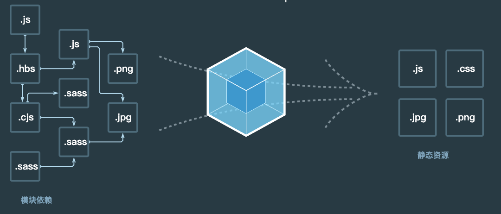

## 一、介绍

本质上，**webpack** 是一个用于现代 JavaScript 应用程序的 *静态模块打包工具*。当 webpack 处理应用程序时，它会在内部从一个或多个入口点构建一个 依赖图(dependency graph)，然后将你项目中所需的每一个模块组合成一个或多个 *bundles*，它们均为静态资源，用于展示你的内容。



## 二、配置

**webpack 的配置文件`webpack.config.js`是 JavaScript 文件，文件内导出了一个 webpack配置的对象** webpack 会根据该配置定义的属性进行处理。

由于 webpack 遵循 CommonJS 模块规范，因此，你**可以在配置中使用**：

- 通过 `require(...)` 引入其他文件
- 通过 `require(...)` 使用 npm 下载的工具函数
- 使用 JavaScript 控制流表达式，例如 `?:` 操作符
- 对 value 使用常量或变量赋值
- 编写并执行函数，生成部分配置

### 1.入口(entry)

**入口起点(entry point)** 指示 webpack 应该使用哪个模块作为构建其内部依赖图(dependency graph) 的开始。进入入口起点后，webpack 会找出有哪些模块和库是入口起点（直接和间接）依赖的，默认值是 `./src/index.js。

简写语法：`entry: string | [string]`

```js
module.exports = {
  entry: './path/to/my/entry/file.js',
};
```

```js
module.exports = {
  entry: ['./src/file_1.js', './src/file_2.js'],
  output: {
    filename: 'bundle.js',
  },
};
```

对象语法：`entry: { <entryChunkName> string | [string] } | {}`

```js
module.exports = {
  entry: {
    app: './src/app.js',
    adminApp: './src/adminApp.js',
  },
};
```

对象语法会比较繁琐。然而，这是应用程序中定义入口的最可扩展的方式。当你通过插件生成入口时，你可以传递空对象 `{}` 给 `entry`。

用于描述入口的对象。你可以使用如下属性：

- `dependOn`: 当前入口所依赖的入口。它们必须在该入口被加载前被加载。
- `filename`: 指定要输出的文件名称。
- `import`: 启动时需加载的模块。
- `library`: 指定 library 选项，为当前 entry 构建一个 library。
- `runtime`: 运行时 chunk 的名字。如果设置了，就会创建一个新的运行时 chunk。在 webpack 5.43.0 之后可将其设为 `false` 以避免一个新的运行时 chunk。
- `publicPath`: 当该入口的输出文件在浏览器中被引用时，为它们指定一个公共 URL 地址。

```js
module.exports = {
  entry: {
    a2: './a',
    b2: {
      runtime: 'x2',
      dependOn: 'a2',
      import: './b',
    },
  },
};
```

### 2.输出(output)

**output** 属性告诉 webpack 在哪里输出它所创建的 *bundle*，以及如何命名这些文件。主要输出文件的默认值是 `./dist/main.js`，其他生成文件默认放置在 `./dist` 文件夹中。注意，即使可以存在多个 `entry` 起点，但只能指定一个 `output` 配置。

```js
module.exports = {
  entry: {
    app: './src/app.js',
    search: './src/search.js',
  },
  output: {
    filename: '[name].js',
    path: __dirname + '/dist',
  },
};

// 写入到硬盘：./dist/app.js, ./dist/search.js
```

### 3.loader

webpack 只能理解 JavaScript 和 JSON 文件，这是 webpack 开箱可用的自带能力。**loader** 让 webpack 能够去处理其他类型的文件，并将它们转换为有效模块，以供应用程序使用，以及被添加到依赖图中。webpack 的其中一个强大的特性就是能通过 `import` 导入任何类型的模块（例如 `.css` 文件），这可以使开发人员创建出更准确的依赖关系图。而loader 就是用于转换某些类型模块的。

在 webpack 的配置中，**loader** 有两个属性：

1. `test` 属性，识别出哪些文件会被转换。
2. `use` 属性，定义出在进行转换时，应该使用哪个 loader。

```js
const path = require('path');

module.exports = {
  output: {
    filename: 'my-first-webpack.bundle.js',
  },
  module: {
    rules: [
      { test: /\.txt$/, use: 'raw-loader' },//告诉webpack 编译器，当碰到「在 require()/import 语句中被解析为 '.txt' 的路径」时，在你对它打包之前，先 use(使用) raw-loader 转换一下。
      {
        test: /\.css$/,
        use: [
          // [style-loader](/loaders/style-loader)
          { loader: 'style-loader' },
          // [css-loader](/loaders/css-loader)
          {
            loader: 'css-loader',
            options: {
              modules: true
            }
          },
          // [sass-loader](/loaders/sass-loader)
          { loader: 'sass-loader' }
        ]
      },
      { test: /\.ts$/, use: 'ts-loader' },//typescript loader
    ],
  },
};
```

有两种使用 loader 的方式：

- 配置方式（推荐）：在 **webpack.config.js** 文件中指定 loader。

- 内联方式：在每个 `import` 语句中显式指定 loader。

  通过为内联 `import` 语句添加前缀，可以覆盖配置中的所有 loader, preLoader 和 postLoader。

  - 使用 `!` 前缀，将禁用所有已配置的 normal loader(普通 loader)

    ```js
    import Styles from '!style-loader!css-loader?modules!./styles.css';
    ```

  - 使用 `!!` 前缀，将禁用所有已配置的 loader（preLoader, loader, postLoader）

    ```js
    import Styles from '!!style-loader!css-loader?modules!./styles.css';
    ```

  - 使用 `-!` 前缀，将禁用所有已配置的 preLoader 和 loader，但是不禁用 postLoaders

    ```js
    import Styles from '-!style-loader!css-loader?modules!./styles.css';
    ```

### 4.plugin

插件可用于打包优化，资源管理和注入环境变量。

想要使用一个插件，你只需要 `require()` 它，然后把它添加到 `plugins` 数组中。多数插件可以通过选项(option)自定义。由于**插件**可以携带参数/选项，你必须在 webpack 配置中，向 `plugins` 属性传入一个 `new` 实例。

```js
const HtmlWebpackPlugin = require('html-webpack-plugin');
const webpack = require('webpack'); // 访问内置的插件
const path = require('path');

module.exports = {
  entry: './path/to/my/entry/file.js',
  output: {
    filename: 'my-first-webpack.bundle.js',
    path: path.resolve(__dirname, 'dist'),
  },
  module: {
    rules: [
      {
        test: /\.(js|jsx)$/,
        use: 'babel-loader',
      },
    ],
  },
  plugins: [
    new webpack.ProgressPlugin(),
    new HtmlWebpackPlugin({ template: './src/index.html' }),
  ],
};
```

### 5.模式(Mode)

提供 `mode` 配置选项，告知 webpack 使用相应模式的内置优化。

```
string = 'production': 'none' | 'development' | 'production'
```

```javascript
module.exports = {
  mode: 'development',
};
```

| 选项          | 描述                                                         |
| :------------ | :----------------------------------------------------------- |
| `development` | 会将 `DefinePlugin` 中 `process.env.NODE_ENV` 的值设置为 `development`. 为模块和 chunk 启用有效的名。 |
| `production`  | 会将 `DefinePlugin` 中 `process.env.NODE_ENV` 的值设置为 `production`。为模块和 chunk 启用确定性的混淆名称，`FlagDependencyUsagePlugin`，`FlagIncludedChunksPlugin`，`ModuleConcatenationPlugin`，`NoEmitOnErrorsPlugin` 和 `TerserPlugin` 。 |
| `none`        | 不使用任何默认优化选项                                       |


### 6.模块(module)

Webpack 天生支持如下模块类型：

- ECMAScript 模块
- CommonJS 模块
- AMD 模块
- Assets
- WebAssembly 模块

通过 **loader** 可以使 webpack 支持多种语言和预处理器语法编写的模块。**loader** 向 webpack 描述了如何处理非原生*模块*，并将相关**依赖**引入到你的 **bundles**中。 webpack 社区已经为各种流行的语言和预处理器创建了 *loader*，其中包括：

- CoffeeScript
- TypeScript
- ESNext (Babel)
- Sass
- Less
- Stylus
- Elm

模块解析路径：

* 绝对路径

  ```js
  import '/home/me/file';
  
  import 'C:\\Users\\me\\file';
  ```

  

* 相对路径

  ```js
  import '../src/file1';
  import './file2';
  ```

  

* 模块路径

  ```js
  import 'module';
  import 'module/lib/file';
  ```

  可以通过配置别名的方式来替换初始模块路径，具体请参照 `resolve.alias` 配置选项。

### 7.target

由于 JavaScript 既可以编写服务端代码也可以编写浏览器代码，所以 webpack 提供了多种部署 *target*，你可以在 webpack 的配置选项中进行设置。

```js
const path = require('path');
const serverConfig = {
  target: 'node',
  output: {
    path: path.resolve(__dirname, 'dist'),
    filename: 'lib.node.js',
  },
  //…
};

const clientConfig = {
  target: 'web', // <=== 默认为 'web'，可省略
  output: {
    path: path.resolve(__dirname, 'dist'),
    filename: 'lib.js',
  },
  //…
};

module.exports = [serverConfig, clientConfig];
//将会在 dist 文件夹下创建 lib.js 和 lib.node.js 文件
```


### 8.开发环境

开发环境一般将`mode` 设置为 `'development'。

#### 8.1source map

为了更容易地追踪 error 和 warning，JavaScript 提供了source maps 功能，可以将编译后的代码映射回原始源代码。如果一个错误来自于 `b.js`，source map 就会明确的告诉你。

source map 有许多可用选项，请务必仔细阅读它们，以便可以根据需要进行配置。

https://www.webpackjs.com/configuration/devtool

```js
//webpack.config.js
const path = require('path');
 const HtmlWebpackPlugin = require('html-webpack-plugin');

 module.exports = {
   mode: 'development',
   entry: {
     index: './src/index.js',
     print: './src/print.js',
   },
  devtool: 'inline-source-map',//使用 inline-source-map
   plugins: [
     new HtmlWebpackPlugin({
       title: 'Development',
     }),
   ],
   output: {
     filename: '[name].bundle.js',
     path: path.resolve(__dirname, 'dist'),
     clean: true,
   },
 };
```

#### 8.2热编译开发工具

在每次编译代码时，手动运行 `npm run build` 会显得很麻烦。

webpack 提供几种可选方式，帮助你在代码发生变化后自动编译代码（某些编辑器具有 "safe write(安全写入)" 功能，会影响重新编译）：

* ### watch mode(观察模式)

  ```js
  //package.json 
  {
     "name": "webpack-demo",
     "version": "1.0.0",
     "description": "",
     "private": true,
     "scripts": {
       "test": "echo \"Error: no test specified\" && exit 1",
      "watch": "webpack --watch",//启用watch mode脚本
       "build": "webpack"
     },
     "keywords": [],
     "author": "",
     "license": "ISC",
     "devDependencies": {
       "html-webpack-plugin": "^4.5.0",
       "webpack": "^5.4.0",
       "webpack-cli": "^4.2.0"
     },
     "dependencies": {
       "lodash": "^4.17.20"
     }
   }
  ```

  在命令行中运行 `npm run watch`，进入观察模式。 当源代码修改并保存后webpack 自动地重新编译修改后的模块！这种方式唯一的缺点是，为了看到修改后的实际效果，需要手动刷新浏览器。

* ### webpack-dev-server

  `webpack-dev-server` 为你提供了一个基本的 web server，并且具有 live reloading(实时重新加载) 功能。

  ```js
  //webpack.config.js 
  const path = require('path');
   const HtmlWebpackPlugin = require('html-webpack-plugin');
  
   module.exports = {
     mode: 'development',
     entry: {
       index: './src/index.js',
       print: './src/print.js',
     },
     devtool: 'inline-source-map',
    devServer: { //dev server 默认端口8080
      static: './dist',
    },
     plugins: [
       new HtmlWebpackPlugin({
         title: 'Development',
       }),
     ],
     output: {
       filename: '[name].bundle.js',
       path: path.resolve(__dirname, 'dist'),
       clean: true,
     },
    optimization: {
      runtimeChunk: 'single',
    },
   };
  ```

  以上配置告知 `webpack-dev-server`，将 `dist` 目录下的文件 serve 到 `localhost:8080` 下。

  添加运行`dev server`的脚本：

  ```js
  {
     "name": "webpack-demo",
     "version": "1.0.0",
     "description": "",
     "private": true,
     "scripts": {
       "test": "echo \"Error: no test specified\" && exit 1",
       "watch": "webpack --watch",
      "start": "webpack serve --open", //dev server启动脚本
       "build": "webpack"
     },
     "keywords": [],
     "author": "",
     "license": "ISC",
     "devDependencies": {
       "html-webpack-plugin": "^4.5.0",
       "webpack": "^5.4.0",
       "webpack-cli": "^4.2.0",
       "webpack-dev-server": "^3.11.0"
     },
     "dependencies": {
       "lodash": "^4.17.20"
     }
   }
  ```

  运行 `npm start`，我们会看到浏览器自动加载页面。如果你更改任何源文件并保存它们，web server 将在编译代码后自动重新加载。

  `dev server`的配置项详细参考：https://www.webpackjs.com/configuration/dev-server/

  

* ### webpack-dev-middleware

  `webpack-dev-middleware` 是一个封装器(wrapper)，它可以把 webpack 处理过的文件发送到一个 server。`webpack-dev-server` 在内部使用了它，然而它也可以作为一个单独的 package 来使用，以便根据需求进行更多自定义设置。

  https://www.webpackjs.com/guides/development/#using-webpack-dev-middleware


### 9.生产环境

**生产环境**目标则转移至其他方面，关注点在于压缩 bundle、更轻量的 source map、资源优化等，通过这些优化方式改善加载时间。由于要遵循逻辑分离，我们通常建议为每个环境编写**彼此独立的 webpack 配置**。

#### 9.1配置分离

一般情况下将webpack配置拆分为`webpack.common.js`、`webpack.dev.js`和`webpack.prod.js`。然后通过webpack-merge工具将`webpack.common.js`和其他合并使用。

安装 `webpack-merge`：

```shell
npm install --save-dev webpack-merge
```

```js
//webpack.common.js
 const path = require('path');
 const HtmlWebpackPlugin = require('html-webpack-plugin');

 module.exports = {
   entry: {
     app: './src/index.js',
   },
   plugins: [
     new HtmlWebpackPlugin({
       title: 'Production',
     }),
   ],
   output: {
     filename: '[name].bundle.js',
     path: path.resolve(__dirname, 'dist'),
     clean: true,
   },
 };
```

```js
//webpack.dev.js
 const { merge } = require('webpack-merge');
 const common = require('./webpack.common.js');

 module.exports = merge(common, {
   mode: 'development',
   devtool: 'inline-source-map',
   devServer: {
     static: './dist',
   },
 });
```

```js
//webpack.prod.js
 const { merge } = require('webpack-merge');
 const common = require('./webpack.common.js');

 module.exports = merge(common, {
   mode: 'production',
 });
```

把 `scripts` 重新指向到新配置，`npm start` script 中 `webpack-dev-server`, 使用 `webpack.dev.js`, 而让 `npm run build` script 使用 `webpack.prod.js`:

```js
//package.json
{
    "name": "development",
    "version": "1.0.0",
    "description": "",
    "main": "src/index.js",
    "scripts": {
     "start": "webpack serve --open --config webpack.dev.js",//使用 `webpack.dev.js`
     "build": "webpack --config webpack.prod.js"//使用 `webpack.prod.js`
    },
    "keywords": [],
    "author": "",
    "license": "ISC",
    "devDependencies": {
      "css-loader": "^0.28.4",
      "csv-loader": "^2.1.1",
      "express": "^4.15.3",
      "file-loader": "^0.11.2",
      "html-webpack-plugin": "^2.29.0",
      "style-loader": "^0.18.2",
      "webpack": "^4.30.0",
      "webpack-dev-middleware": "^1.12.0",
      "webpack-dev-server": "^2.9.1",
      "webpack-merge": "^4.1.0",
      "xml-loader": "^1.2.1"
    }
  }
```

**指定`mode`**

许多 library 通过与 `process.env.NODE_ENV` 环境变量关联，以决定 library 中应该引用哪些内容。例如，当`process.env.NODE_ENV` 没有被设置为 `'production'` 时，某些 library 为了使调试变得容易，可能会添加额外的 log(日志记录) 和 test(测试) 功能。并且，在使用 `process.env.NODE_ENV === 'production'` 时，一些 library 可能针对具体用户的环境，删除或添加一些重要代码，以进行代码执行方面的优化。从 webpack v4 开始, 指定 `mode`会自动地配置 `DefinePlugin` 。

`DefinePlugin` 允许在 **编译时** 将你代码中的变量替换为其他值或表达式。这在需要根据开发模式与生产模式进行不同的操作时，非常有用。例如，如果想在开发构建中进行日志记录，而不在生产构建中进行，就可以定义一个全局常量去判断是否记录日志。这就是 `DefinePlugin` 的发光之处，设置好它，就可以忘掉开发环境和生产环境的构建规则。

#### 9.2压缩

Webpack v4+在生产环境下默认使用 [`TerserPlugin`](https://www.webpackjs.com/plugins/terser-webpack-plugin) 压缩代码，并且也是代码压缩方面比较好的选择，但是还有一些其他可选择项。如：

- [`ClosureWebpackPlugin`](https://github.com/webpack-contrib/closure-webpack-plugin)


#### 9.3源代码映射

我们鼓励你在生产环境中启用 source map，因为它们对 debug(调试源码) 和运行 benchmark tests(基准测试) 很有帮助。虽然有着如此强大的功能，然而还是应该针对生产环境用途，选择一个可以快速构建的推荐配置（更多选项请查看 [`devtool`](https://www.webpackjs.com/configuration/devtool)）。对于本指南，我们将在 *生产环境* 中使用 `source-map` 选项，而不是我们在 *开发环境* 中用到的 `inline-source-map`：

`webpack.prod.js`:

```diff
  const { merge } = require('webpack-merge');
  const common = require('./webpack.common.js');

  module.exports = merge(common, {
    mode: 'production',
+   devtool: 'source-map',
  });
```


